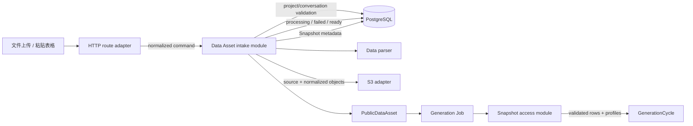

# 收拢 Conversation-bound Data Asset intake：设计

- 变更编号：`CHG-2026-09-16-DATA-ASSET-INTAKE`
- 状态：`VERIFYING`
- 创建时间：2026-09-16
- 更新时间：2026-09-16

## 现状与约束

当前 upload 和 paste route 都调用 [ingestDataAsset](../../../apps/api/src/data-assets.ts)，该函数同时完成 Project/Conversation 查询、路径生成、Data Asset 插入、解析、两个对象写入、Snapshot 插入和状态更新。生产对象存储由 [packages/storage](../../../packages/storage/src/index.ts) 的 S3/MinIO adapter 提供，已有 `deleteObject`，但 intake 尚未使用补偿。

当前持久化关系为：

- `data_assets` 是 Project-owned，目标状态是包含不可变、非空的 `sourceConversationId`、原始对象 key 和可审计 `errorCode` 的记录；
- `data_snapshots` 属于 Data Asset，包含字段画像、预览和 normalized object key；
- 当前 `sourceConversationId` 的 FK 使用 `ON DELETE SET NULL`，本次迁移将移除该删除行为，保留不可变来源 UUID；
- Snapshot access module 只要求来源标识非空且可重建当前 Conversation-scoped canonical key，不要求来源 Conversation 行仍然存在。

必须继续遵守以下约束：

1. Data Asset 的所有权归 Project，不能改成 Conversation-owned；
2. 不生成或兼容旧的项目级 object key；历史数据允许清理；
3. Generation Worker 只通过 Snapshot access module 获得已验证的 `rows`、`profiles` 和标识；
4. 当前只有一个真实对象存储 adapter，不提前制造跨包的通用 interface；
5. 第一阶段仍只支持一个 Project、一个 Data Snapshot、一个 Generation Cycle 的咨询报告闭环。

## 设计目标与非目标

### 设计目标

- 让 Data Asset intake 成为一个有足够 depth、但 interface 窄的写入 module；
- 将跨 PostgreSQL/S3 的补偿语义集中在 intake module，保持失败可解释；
- 让 upload、paste 和未来的其他输入方式共享同一个领域 command；
- 让错误码、状态流转、来源关系和 canonical key 具备稳定的可测试 seam；
- 保持对象 key、Buffer 和解析细节不进入 PublicDataAsset 或 Generation Workflow。

### 非目标

- 不在本次变更实现 LLM 文件工具、向量索引或异步 Data Worker；
- 不改变 Snapshot access module 的读取契约；
- 不实现跨文件 Join、实时数据源或通用 BI 能力；
- 不把唯一的 S3 adapter 抽象成正式的多实现 Storage interface；
- 产品方向确定同一 Data Asset 的 re-ingest 追加 Snapshot，但本次不实现其 HTTP 操作，也不通过创建新 Data Asset 模拟版本管理。

## 已确认决策

1. **Snapshot 版本语义**：同一 Data Asset 的重新上传最终追加新的 Data Snapshot；具体 re-ingest HTTP 操作、source object 版本保留和并发版本分配另立变更。
2. **来源 Conversation 生命周期**：`sourceConversationId` 是不可变、非空的来源/路径标识；移除 `ON DELETE SET NULL`，允许来源 Conversation 删除。Data Asset 仍然归 Project 所有；读模型和审计必须显示 `sourceConversationDeleted` 或等价的“来源 Conversation 已删除”状态。
3. **当前变更边界**：只实现一次 intake 的补偿、错误语义和来源标识迁移，不实现已有 Data Asset 的 re-ingest endpoint。

## 方案选型

| 方案 | 优点 | 缺点 | 结论 |
| --- | --- | --- | --- |
| 保持现状，只增加 route 校验 | 改动小 | 孤儿对象、错误分类和 Schema 冲突仍存在 | 不选 |
| 新建一个 wrapper 调用现有 `ingestDataAsset` | 文件名看起来更清晰 | 不增加 depth，失败语义仍在旧函数内 | 不选 |
| 深化现有 Data Asset module，并注入 module-private callbacks | 保持 locality，可测试补偿，不制造浅 module | 需要调整现有函数内部结构 | 采用 |
| 现在建立正式 StoragePort 和多个 adapter | 未来可替换 | 当前只有一个真实 adapter，增加空抽象 | 不选 |

## 模块边界

| module / adapter | 负责 | 不负责 |
| --- | --- | --- |
| HTTP route adapter | 身份、Project action、multipart/JSON 解析、command 组装、错误响应 | S3 生命周期、Snapshot 版本、对象清理 |
| Data Asset intake module | 来源关系、canonical key、解析编排、DB 状态、对象补偿、PublicDataAsset projection | Generation Job、LLM、Conversation 所有权 |
| `packages/data-engine` parser | 将输入 bytes 解析为 columns、rows、profiles、preview | DB、S3、状态更新 |
| `packages/storage` S3 adapter | `putObject`、`deleteObject` 和底层 provider 调用 | Data Asset 业务状态和权限 |
| PostgreSQL/DB module | Data Asset/Snapshot 元数据和事务 | 对象存储补偿 |
| Snapshot access module | 校验冻结关系、重建 key、读取并验证 normalized Snapshot | 上传、解析和对象写入 |

建议的 module-private command 形状为：

```ts
type DataAssetIntakeCommand = {
  projectId: string;
  sourceConversationId: string;
  createdBy: string;
  source: {
    name: string;
    sourceType: DataSourceType;
    mimeType: string;
    bytes: Buffer;
  };
};
```

生产调用仍由 S3 adapter 提供 `putObject` 和 `deleteObject`；测试可以通过内存 callback 注入失败点。该 callback seam 不作为公共跨包合同导出。

## 数据模型与状态流转

### Data Asset 状态

```text
无记录
  │
  ▼
processing
  ├─ 解析失败 / 对象写入失败 / DB 提交失败 ──► failed
  └─ Snapshot 元数据和状态更新成功 ─────────► ready
```

`failed` 记录保留 `assetId`、失败 code 和用户可读消息；已成功写入的对象先执行 best-effort 删除。补偿失败必须记录内部审计事件，不得伪装成 `ready`。

### 成功路径

1. Route 校验 `manage_data` 权限，并将 upload 或 paste 归一化为 `DataAssetIntakeCommand`。
2. Intake 查询 Project 的 `workspaceId`，验证 `sourceConversationId` 为 UUID 且在创建时属于该 Project；该校验结果成为不可变来源记录。
3. Intake 生成 `assetId`、`snapshotId` 和经过统一 helper 生成的 source/normalized canonical key。
4. 插入 `data_assets(status = processing)`；此时不向客户端返回内部 key。
5. 调用 parser 得到 `columns`、`rows`、`profiles`、`preview`。
6. 写入 source object，并记录成功 key。
7. 写入 normalized JSON，并记录成功 key。
8. 在 DB transaction 中插入 `data_snapshots` 并将 Data Asset 更新为 `ready`。
9. 通过 read projection 返回不含 object key 的 `PublicDataAsset`。

### 失败路径

```text
任一阶段失败
  ├─ 已写入 source?     delete source
  ├─ 已写入 normalized? delete normalized
  ├─ 更新 Data Asset = failed + failure code
  └─ cleanup 失败?      写审计事件/指标，保留待处理证据
```

DB transaction 只能覆盖 PostgreSQL 内部的 Snapshot 插入和 `ready` 更新，不能假设它能回滚 S3；S3 通过补偿完成跨系统一致性。

## API / 外部契约

### 保持不变

- `POST /api/v1/projects/:projectId/data-assets/upload` 继续接受 multipart 文件和 `conversationId`；
- `POST /api/v1/projects/:projectId/data-assets/paste` 继续接受 `name`、`content` 和 `conversationId`；
- 成功响应继续只返回 PublicDataAsset，不返回原始或 normalized object key；
- 不新增旧项目级路径的兼容读取。

### 需要调整

- 引入稳定的 intake error code，并由 route adapter 映射状态：

| 错误 code | 典型状态 | 含义 |
| --- | --- | --- |
| `DATA_ASSET_TOO_LARGE` | 413 | 输入超过限制 |
| `SOURCE_CONVERSATION_INVALID` | 400/404 | 来源 Conversation 无效或不属于 Project |
| `DATA_PARSE_FAILED` | 422 | 文件格式或内容无法解析 |
| `SOURCE_OBJECT_WRITE_FAILED` | 503 | 原始对象写入失败 |
| `SNAPSHOT_OBJECT_WRITE_FAILED` | 503 | normalized 对象写入失败 |
| `SNAPSHOT_PERSIST_FAILED` | 500 | Snapshot 元数据写入失败 |
| `DATA_ASSET_CLEANUP_FAILED` | 内部审计 | 补偿删除失败，不直接暴露 provider 细节 |

- 完成迁移后，将 asset DTO 的 `sourceConversationId` 调整为 required，并增加派生的 `sourceConversationDeleted: boolean`（或同等语义字段）；当左连接不到 Conversation 时显示来源已删除，但不影响 Project-owned Data Asset 的读取。

## 架构图



失败路径由 Intake 指向 `deleteObject` 补偿和 `failed` 状态；不会把异常直接传给 GenerationCycle。

## 数据流

### 输入和持久化

```text
multipart / JSON
  → route 提取 bytes、文件元数据、sourceConversationId
  → DataAssetIntakeCommand
  → Project + Conversation 关系校验
  → `data_assets` processing
  → parser 输出结构化 rows/profiles/preview
  → S3 source object
  → S3 normalized JSON
  → `data_snapshots` 元数据
  → `data_assets` ready
```

PostgreSQL 保存关系、状态、画像、预览和 object key；S3 保存原始文件和 normalized rows。Object key 只在 module、storage adapter 和受控 Snapshot access seam 内部流转。

### 生成侧读取

```text
Data Asset/Snapshot metadata
  → Generation Job 固化 assetId + snapshotId
  → Generation Worker 领取 Job
  → Snapshot access module 校验关系并重建 key
  → S3 getObject
  → 验证 JSON、行列数和 profiles
  → FrozenSnapshotInput(rows, profiles, snapshotId, assetId)
  → GenerationCycle
```

Intake module 不直接调用 Worker、GenerationCycle 或 Model Gateway。

## 权限、校验与异常处理

1. Route 继续执行 Project action 权限检查；intake module 不信任 route 传入的 Conversation 关系，必须再次在 Project 条件下查询。
2. `sourceConversationId` 不参与 Data Asset ownership 判断，只参与来源合法性和 canonical key 生成。
3. 文件大小在 multipart plugin 和 intake module 两处保留上限校验，避免非 HTTP 调用绕过限制。
4. 所有 provider/database 原始异常只进入内部日志和结构化错误原因；HTTP 响应和 `errorMessage` 使用稳定 code 与安全消息。
5. Snapshot access module 继续拒绝旧项目级 key、缺失来源标识和关系不一致记录；来源 Conversation 已删除但来源 UUID 完整且 key 一致时，不因 live Conversation 行缺失而拒绝读取。

## 迁移、兼容与回滚

### 迁移前检查

- 枚举 `sourceConversationId IS NULL`、旧项目级 object key 和找不到对应 Snapshot 的历史记录；
- 按用户已确认的历史可丢弃策略清理这些记录和对象；数据库迁移只处理元数据及对象 key 引用，部署清理步骤按迁移前对象清单删除历史孤儿对象；
- 检查所有新生成路径均服从 Conversation-scoped canonical key。

### Schema 迁移决策

采用已确认的方案 B：

1. 清理允许丢弃的 `sourceConversationId IS NULL` 记录、旧项目级 object key 引用和无法重建 Snapshot key 的历史记录；迁移不直接调用 S3，部署清理步骤负责依据迁移前对象清单删除对应历史孤儿对象；
2. 将 `data_assets.sourceConversationId` 改为 `NOT NULL`；
3. 移除指向 live `conversations` 行的 `ON DELETE SET NULL` 约束（实现上不保留会阻止删除 Conversation 的强 FK），保留该 UUID 作为不可变来源/路径标识；
4. intake 创建时仍必须验证 Conversation 属于当前 Project；
5. `getDataAsset`、列表读模型和审计通过 left join 或存在性查询派生 `sourceConversationDeleted`，不把 Data Asset 所有权转移给 Conversation；
6. Snapshot access module 以 `projectId + assetId + sourceConversationId + snapshotId` 重建 key，不要求 Conversation 行仍存在。

该方案牺牲了 live FK 的引用完整性，换取 Project-owned Data Asset 不受 Conversation 删除影响。不可变 UUID、Project 关系和 canonical key 校验共同承担安全约束。迁移中的数据库清理与对象存储清理保持分层：数据库迁移删除不可恢复的无效元数据引用，部署运维按受控对象清单处理历史对象；运行时 intake 对新孤儿对象负责 best-effort 补偿并审计失败。

### 回滚

- 代码回滚：恢复 intake module 的调用实现，但不恢复旧项目级路径 fallback；
- Schema 迁移：先在事务中完成数据清理和约束变更，迁移失败则不提交；
- 补偿失败：不自动删除数据库失败记录，保留 `failed` 状态和审计信息，后续由清理任务处理；
- 不执行破坏性 Git 回退，不触碰用户已有工作树修改。

## 日志、监控与可观测性

每次 intake 至少记录结构化字段：`requestId`、`assetId`、`projectId`、`sourceConversationId`、阶段、稳定 error code、补偿结果和耗时。不得记录文件 bytes、完整内容或向客户端暴露 object key。

建议指标：

- `data_asset_intake_total{source_type,result}`；
- `data_asset_intake_failure_total{phase,error_code}`；
- `data_asset_cleanup_failure_total`；
- 解析、S3 写入和 DB 提交耗时。

## 测试策略

- module 单元测试使用内存 callback 覆盖成功和每个写入失败点；
- route 测试覆盖 upload/paste 的 command 归一化、权限和错误码映射；
- DB 集成测试覆盖 `processing → ready/failed` 和 Snapshot metadata transaction；
- 对象存储集成测试至少验证 source/normalized key 和补偿删除；
- 合同测试验证 `sourceConversationId`、错误响应和 object key 不出现在 PublicDataAsset；
- 迁移测试验证历史无效记录清理和新约束；
- 不在本次引入 LLM 或 Worker 行为变化，因此不新增模型供应商测试。

## 需求追踪矩阵

| 需求 | 设计 | 任务 | 测试 | commit |
| --- | --- | --- | --- | --- |
| R1 upload/paste 共享 intake module | D1 模块边界、D2 command | T1/T2 | route + module unit | `apps/api/src/routes.ts`、`apps/api/src/data-assets.ts` |
| R2 跨 PostgreSQL/S3 失败可补偿 | D3 状态流、D4 失败路径 | T3/T4 | failure/cleanup tests | `apps/api/test/unit/data-assets.test.ts` |
| R3 关系和 canonical key 一致 | D2、D5 权限校验、迁移 | T2/T5 | relation/key/contract tests | intake unit、Snapshot access tests、`packages/db/drizzle/0021_data_asset_intake_lifecycle.sql` |
| R4 错误可审计且不泄露 provider 细节 | D6 error mapping、D7 observability | T6 | HTTP/error tests | `apps/api/src/routes.ts`、API/contract tests |
| R5 Data Asset 保持 Project-owned | D1、D5 | T5 | ownership regression tests | `docs/architecture/domain-model.md`、worker access tests |
| R6 Snapshot re-ingest 方向确定但不在本次实现 | D8 已确认决策与后续变更边界 | T0/T7 | product/design review | proposal/design/ADR-0020 |
| R7 来源 Conversation 删除后仍可审计/读取 | D9 不可变来源 UUID、派生删除状态 | T0/T5/T6 | migration/read-model/access tests | contracts、schema、Data Asset read projection、ADR-0020 |
