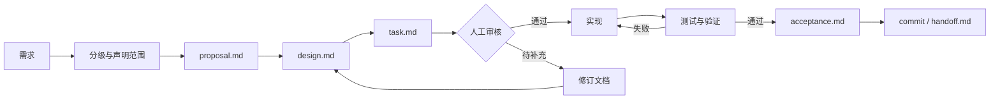

# 建立 LangReport SDD 项目治理体系：设计

- 变更编号：`CHG-2026-09-16-SDD-GOVERNANCE`
- 状态：`REVIEWING`
- 创建时间：2026-09-16
- 更新时间：2026-09-16

## 现状与约束

当前仓库是由 `apps/*` 和 `packages/*` 组成的 pnpm monorepo，已有根 `AGENTS.md`、`CONTEXT.md`、产品/架构/Agent 文档和 `docs:check`。根目录缺少 `CLAUDE.md`、`.agents/manifest.json`、项目结构基线和变更目录规范。现有工作树包含用户未提交修改，本次只能新增或修改治理范围内文档及 `scripts/docs-check.mjs` 的目录白名单。

权威关系必须保持单向：业务术语在 `CONTEXT.md`，产品边界在第一阶段规格，技术事实在项目基线和架构文档，长期取舍在 ADR，一次变更的计划和证据在 `docs/changes/<change-id>/`。

## 设计目标与非目标

目标是让 Agent 和开发者能快速加载正确上下文、按状态门禁推进中大型变更，并把需求、设计、任务、测试、验收和交接放到一个变更编号下。非目标是构建新的 CI 服务、修改运行时架构、替换现有领域模型或为每个工具复制整套项目事实。

## 方案选型

| 方案 | 优点 | 缺点 | 结论 |
| --- | --- | --- | --- |
| 各工具各自维护一套项目说明 | 初期接入快 | 事实重复、容易漂移、交接断链 | 不选 |
| 只增加一份总 README | 人类入口简单 | 无模块路由、无变更状态和验收证据 | 不选 |
| 根权威文档 + manifest 路由 + 变更目录 | 事实单一、按任务加载、可审计可交接 | 需要维护路由和变更文档 | 采用 |

## 模块边界

| 入口 | 责任 | 不负责 |
| --- | --- | --- |
| `AGENTS.md` | 跨工具协作规则和产品边界 | 详细实现事实 |
| `CLAUDE.md` | Claude 的薄适配和入口顺序 | 复制业务规则 |
| `.agents/manifest.json` | 上下文路由和验证命令索引 | 运行时权限或 CI 执行 |
| `docs/project-spec.md` | 当前代码结构和事实基线 | 一次变更的设计细节 |
| `docs/changes/` | 变更生命周期、追踪、验收和交接 | 产品术语定义 |
| `docs/adr/` | 长期架构/治理取舍 | 临时任务清单 |

## 数据模型与状态流转

本次没有运行时数据模型变更。治理记录以目录为聚合边界，每个变更包含六份互相引用的 Markdown 文档，并共享一个 `change-id`。

```text
DRAFT
  → REVIEWING
  → APPROVED
  → IMPLEMENTING
  → VERIFYING
  → ACCEPTED
  → COMMITTED
  → ARCHIVED
```

状态含义和门禁统一定义在 [docs/changes/README.md](../README.md)。本次初始化停留在 `REVIEWING`，因为项目维护者的人工审核结论尚未记录；文档机制本身可以先被检查和复核。

## API / 外部契约

本次没有 HTTP、数据库、模型供应商、对象存储或插件 API 变化。`.agents/manifest.json` 是仓库内 Agent 协作约定，使用 `version`、`project`、`context`、`routes` 和 `checks` 五个稳定顶层字段；后续自动化接入不得把它误当成业务 API。

## 架构图



成功路径落点是变更目录、测试证据和 Git 历史；失败路径保留失败项并回到文档或实现阶段。异步边界是会话交接：新会话只从根上下文、项目基线和当前变更目录恢复。权限边界是 Agent 只修改任务范围内的文件，不自动推送或覆盖用户既有修改。

## 数据流

```text
AGENTS + CONTEXT + project-spec
  → manifest route selects task context
  → proposal defines R
  → design defines D and constraints
  → task defines T and proof
  → implementation changes scoped files
  → test-plan selects evidence
  → acceptance records result
  → handoff records next session
  → commit links history to change-id
```

持久化落点全部是版本控制中的 Markdown/JSON 文件；本次没有写入应用数据库、对象存储或外部系统。

## 权限、校验与异常处理

- 使用 `CONTEXT.md` 术语；发现冲突时记录代码事实和目标规范，不创建同义实体；
- 变更开始和结束检查 `git status`/`git diff`，只触碰本次治理文件；
- `docs:check` 校验 docs 根目录唯一导航、相对链接和 Markdown 锚点；JSON 通过 `ConvertFrom-Json` 校验；
- 状态未达到 `APPROVED` 时，不以本变更为依据生成业务代码；
- 用户修改与治理文件冲突时暂停，不用破坏性命令清理；
- 验证失败写入 `acceptance.md`，不把部分结果标成通过；
- 无外部凭据、无敏感数据、无新的执行权限需求。

## 迁移、兼容与回滚

本次没有数据库或运行时迁移。旧文档入口继续有效，只在根 README 和 `docs/README.md` 增加导航。若治理方案需要回退，应通过保留历史的文档变更撤回新增入口，并先重新运行 docs-check；不得使用破坏性 Git 清理覆盖用户修改。

## 日志、监控与可观测性

治理结果通过以下证据可观察：manifest JSON 可解析、docs-check 输出、`git diff --check` 输出、变更目录内的验收矩阵和 handoff。未引入运行时日志或指标；后续 CI 门禁需另立变更记录。

## 测试策略

本次以文档和配置校验为主：运行 `pnpm docs:check`、解析 `.agents/manifest.json`、运行 `git diff --check`，并按本次文件清单检查没有业务源码变化。无需运行全量业务测试；若文档校验暴露链接或格式问题，必须在本次变更中修复。

## 需求追踪矩阵

| 需求 | 设计 | 任务 | 测试 | commit |
| --- | --- | --- | --- | --- |
| R1 权威入口单一且职责清晰 | D1 模块边界与入口分工 | T1/T2/T3 | A1 manifest JSON；A2 docs-check | 待提交 |
| R2 按路径加载相关上下文 | D1 manifest routes | T2 | A1 manifest JSON | 待提交 |
| R3 L/XL 变更具备六份 SDD 产物 | D1 状态流转与变更目录 | T4/T5 | A3 文件清单与链接检查 | 待提交 |
| R4 需求可追踪到测试和 Git | D1 数据流与矩阵 | T5/T6 | A4 acceptance/handoff 检查 | 待提交 |
| R5 不改变业务范围和用户已有修改 | D1 权限、回滚和异常 | T1/T6 | A5 diff 范围检查 | 待提交 |
