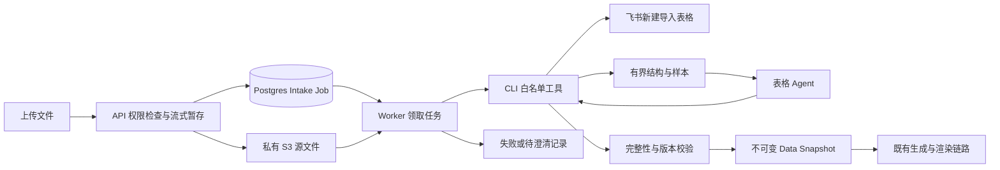

# 设计

- 变更编号：LANGREPORT-2026-09-30-lark-table-agent
- 状态：VERIFYING
- 创建时间：2026-09-30
- 更新时间：2026-10-01

## 边界与数据流

API 将 multipart 流暂存到独立临时目录，校验 50 MB 上限，再流式写入 S3。为飞书输入创建持久化 intake job，返回 202。Generation Worker 的独立轮询执行 intake job；模型密钥继续仅在 Worker 解密。未启用飞书时保持旧接口行为。

`@langreport/lark-data` 封装 CLI 执行、结果协议、表格选择循环和类型化数据转换。Agent 只能检查当前导入 workbook 中的 sheet、选择已经检查过的矩形区域，或提出澄清；不能传入任意命令、路径、token 或身份。原始文件不进入模型上下文，完整 typed table 由工具层保管。

## 执行与一致性

固定 `@larksuite/cli@1.0.97`；直接 spawn 原生 binary，shell=false，独立 cwd，超时和输出大小限制，stdout 与 stderr 分开。禁止继承能覆盖 profile 的 CLI 环境凭据；每次执行显式 profile 和 user 身份，工作开始验证飞书 open_id。

导入动作不自动重试。任务单次领取，执行设置期限；进程中断后的过期任务终止并保留诊断，不自动重复创建云文件。Snapshot 提交与 job 成功状态在同一事务完成，提交前检查任务所有权和期限。失败不会更新旧 Snapshot。远端导入成功后将 token 立即记入任务，后续失败保留其引用供人工清理；不扩大授权自动删除飞书文件。

读取前后核对文档 revision；读取过程中改变则失败。检测所有截断字段、实际范围与二维数据的行列数；超限明确失败。标题和重复字段保留位置映射，不把两个同名列折叠。模型选定列必须由图表编译器实际使用，并验证它们确实存在于转换结果。

## API 与交互

上传 multipart 增加可选 `tableHint`（工作表/表头提示）。飞书模式返回 `{asset,intakeJobId}` / 202；状态查询返回待处理、处理中、成功、失败或待澄清，以及安全错误信息。Web 等待任务结果后刷新资产，不提前显示“快照已创建”。API Console 和 OpenAPI 同步。

## 配置与迁移

显式 `TABLE_INGESTION_PROVIDER=lark` 才启用；要求 owner user/workspace、CLI profile、预期飞书 open_id。默认关闭，不使用机器默认身份。增加 intake job 表，不改写历史数据。回滚先停止新增任务、等待运行结束，再关闭开关；保留已生成快照和审计。

## 测试与规模

用模拟 CLI 协议验证身份、截断、多表、重复列、带标题表和版本变化；模拟模型验证受限工具循环及上下文预算；API/Worker 测试异步状态和失败边界。整张表仅在 Worker 工具层有界解析，CLI 读取不是无限流式；模型观察、工具输出、行列数和总运行时各有硬上限。

## 官方依据

- [CLI 官方仓库](https://github.com/larksuite/cli)
- [类型化读取与截断语义](https://github.com/larksuite/cli/blob/main/skills/lark-sheets/references/lark-sheets-read-data.md)
- [导入和工作簿命令](https://github.com/larksuite/cli/blob/main/skills/lark-sheets/references/lark-sheets-workbook.md)

文档参考 main，实际参数以本机执行的 1.0.97 `--help` 和该版本实现为准。
