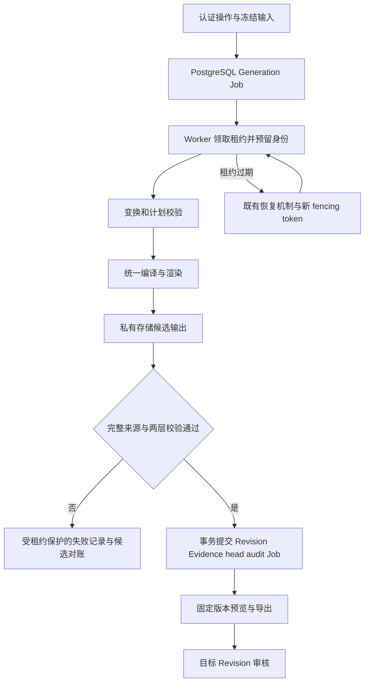

# 证据正确性与版本生命周期修复：设计

- change-id：`CHG-2026-10-03-evidence-correctness-repair`
- 状态：`IMPLEMENTING`（A 批）；全文为目标设计，不描述当前已具备能力。2026-10-03 用户要求继续执行既有任务；运行时取舍仍需 T2 证明，B/C 批尚未启动。
- 创建时间：2026-10-03
- 更新时间：2026-10-03

## 约束、选型与模块责任

遵守 [产品规格](../../product/phase1-consulting-report.md)、[领域不变量](../../architecture/domain-model.md) 与 [Loop 规范](../../agent/agent-loop-spec.md)。一个 Cycle 仅使用一个 Snapshot；来源、口径、模板和内容冻结；成功不等于批准；私有记忆不得通过派生版本扩散。

| 方案                                               | 判断                                                                    |
| -------------------------------------------------- | ----------------------------------------------------------------------- |
| 分别修三套绘图代码                                 | 保留重复语义和再次分叉风险，不作为最终方案                              |
| 统一冻结 Vega-Lite，浏览器和服务端使用同一编译语义 | 推荐；保留 Flint 作为受限语义编译入口；运行时、字体、资源预算需后续实验 |
| 所有预览只展示服务端图片                           | 不能独立满足交互预览，可作为明确标注的错误/降级展示，不作为默认完成标准 |
| 图表复制/回滚继续直接复制数据库字段                | 无法保证新 HTML 身份和完整输出，不采用                                  |
| 为当前修复拆微服务/更换队列                        | 没有必要，保留现有 PostgreSQL 作业                                      |

难以逆转的取舍分别记录于 [ADR-0032](../../adr/0032-canonical-chart-rendering.md)、[ADR-0033](../../adr/0033-atomic-revision-evidence-publication.md)，均为 Proposed。

| Module            | 拟拥有的责任                                                                          |
| ----------------- | ------------------------------------------------------------------------------------- |
| contracts/domain  | 受限输入、错误、图表/审核不变量；不依赖数据库或 UI                                    |
| data-engine       | 按位置解析、保守类型推断、确定性变换、画像；不写 Snapshot                             |
| flint-adapter     | Flint → 冻结 Vega-Lite → 同语义图形/导出与校验；不访问业务数据库                      |
| chart             | 派生上下文、版本预留、完成提交、审核状态；事务内控制 Artifact/Revision/Evidence/audit |
| generation-worker | 执行冻结计划，不替来源读取“最新”Brief/指标；调用生命周期接口                          |
| render-worker     | 外部渲染/对象写入/验证，随后提交候选；不零散修改 Revision 内容                        |
| API/Web           | 认证、合同、状态投影、场景交互；不重复实现图形或持久化业务不变量                      |

不为这一轮再新增泛化 repository/service 框架。先在上述既有包中形成小接口、完整实现。

## D1：完整图表输入与统一渲染（R1、R2）

图表输入来自固定 Revision 的完整 Flint Spec 和变换结果；`previewData.rows` 只服务表格预览。编译一次保存规范化 Vega-Lite 与哈希，浏览器交互预览和服务端输出消费同一规范及冻结 Theme。UI 不再自行计算坐标、负数基线、Area 路径或配色。

服务端依次生成 SVG、PNG、静态 HTML 和 Vega-Lite JSON。HTML 从同一次候选的 SVG、发现、口径及预留 Revision ID/编号构建；禁止新版本复用带旧身份的 HTML。统一渲染不要求跨操作系统文字抗锯齿逐像素相同，但数据、顺序、图形类型、堆叠、零基线、主题和标签语义必须一致。

Render Validation 至少包括：规范结构与字段、输入行数/哈希、负数和零基线、Area 填充/堆叠、数据标记落在绘图区、非空和可解码输出、HTML 元数据与候选一致、禁止外部资源。复杂视觉正确性仍需要黄金样例和人工复核，不能宣称一个通用算法能证明所有图表正确。

用户于 2026-10-04 确定：单图绘制结果上限 10,000 个点。超限返回 `CHART_POINT_BUDGET_EXCEEDED` 和聚合建议；不得用前 500 行自动截断，也不增加隐式 Top-N。Data Snapshot 与首次生成仍保留 100,000 行源输入目标；变换后的绘图结果与源输入行数分别测量。运行时内存、耗时、安全和浏览器交互仍需独立验收。

T2 使用当前锁定 Flint 0.5.1 的实际输出验证候选 Vega/Vega-Lite 运行时、Node/Windows、中文字体、Theme、SVG/PNG、交互事件、构建体积和安全 loader。具体新依赖版本在实验通过后锁定；本轮未安装或验证。不允许将 Snapshot URL、文件路径或任意表达式变成新的用户输入执行通道。

## D2：冻结来源与派生操作（R3、R4）

拟提供 `prepareDerivedRevision` 作为内部接口：接受 actor、project、sourceRevisionId、operation、patch、idempotencyKey，返回冻结执行输入。仅取授权来源 Revision，禁止用项目当前值或空对象覆盖来源事实。

| 字段                                  | 视觉编辑                                             | 数据逻辑编辑                                                            | 复制/回滚                                         |
| ------------------------------------- | ---------------------------------------------------- | ----------------------------------------------------------------------- | ------------------------------------------------- |
| Snapshot、Brief、Metric Definition    | 完整继承                                             | 固定 Snapshot 和原 Brief/指标；改变指标含义必须明确重新确认，不默默沿用 | 完整继承目标版本                                  |
| TransformPlan、lineage、resultSummary | 冻结复用                                             | 重新执行，重建血缘和统计                                                | 冻结复用，校验存在性                              |
| Flint Spec/Theme                      | 应用显式 patch，生成新版本                           | 用新结果编译并校验                                                      | 继承目标内容，重新验证输出                        |
| executionAssembly/来源执行            | 引用来源执行及当前编辑/渲染版本；不得伪称新模型调用  | 明确来源与本次变换执行版本                                              | 保留来源引用及操作审计                            |
| 记忆                                  | 仅继承允许展示的冻结公共来源引用，不重新注入私有偏好 | 同左；需要模型时仍走原撤销/准入机制                                     | 不复制私人调用上下文                              |
| finding                               | 视觉编辑保留来源 Evidence 的发现                     | 依据新统计重新建立候选发现，不能保留与新结果冲突的旧文本                | 保留来源 Evidence 的发现                          |
| Revision/HTML                         | 新 ID、编号、输出身份                                | 同左                                                                    | 新 ID；copy 新 Artifact，rollback 保留原 Artifact |

`undefined` 与空对象不再混用：必需字段缺失时返回 `REVISION_PROVENANCE_INCOMPLETE`，不以 `{}` 达成持久化。旧版本缺来源且无法根据不可变记录证明时，只读保留，重新确认输入后创建新 Cycle。

T5补充实现约定：纯视觉编辑在创建Job时，把来源Revision对应Evidence的finding及Evidence/Revision身份冻结到既有`generationAudit.derivedFinding`，并保存文本SHA-256；这是派生来源审计，不是新模型调用记录。后续渲染、HTML及Evidence均消费同一冻结值，重试不重新读取可变Evidence；缺失或校验不符明确拒绝。逻辑编辑仍依据新统计重建finding。此步骤不改变T6原子完成/T7不可变Evidence的后续范围。

所有派生操作均创建持久化 Generation Job，异步完成。copy/rollback 不调用模型，不访问实时飞书，不建立第二个数据源。各自保留来源 Revision、固定输入和操作 fingerprint；重试不能改变冻结输入。

## D3：版本预留、对象存储和原子完成（R5、R9）

### 版本预留

拟在 Artifact 增加单调修订序列计数，在 Job 增加候选身份/输出清单字段；字段名和 SQL 由实施时 schema 设计落地，不在本轮生成迁移。已有 Artifact 以历史最大版本初始化。

Worker 获租约后，在短事务中按固定顺序锁 Job → Artifact；验证 Project/actor/来源，预留目标 Revision UUID 和编号，写入 Job 候选。初始生成/copy 可先将新 Artifact UUID 和编号 1 保存在 Job 中，完成前不对列表暴露空 Artifact。重试复用同一 Job 预留身份。

失败允许留下未使用的编号空洞，不重用编号；不要求编号连续。并发 head 更新只接受更高的成功版本号；晚完成的低编号版本不得覆盖较新 head。审核更新 publishedRevisionId 不回退 head。

### 渲染与存储

  逐次候选对象账本已落地：Render Worker 在首个 S3 PUT 之前用有效 Job 租约持久化尝试 UUID、预留 Revision UUID、fencing token 和四个计划键；四对象读回后，账本 `validated` 与 Job 清单在一个短事务中保存。业务发布事务以 Job→尝试行锁核对账本身份和全部对象键，并将账本标为 `published`。失败重试保留旧尝试记录，新尝试使用独立键。

  Render Worker 每轮最多对账 10 个候选。默认保留期 24 小时；年龄及有效租约均由 PostgreSQL `clock_timestamp()` 判定。只有无有效租约、键符合本 Job 的 Workspace/Project/Asset/Revision/尝试身份且没有任何 Revision 引用时，才先标记 `deleting`，随后逐键删除。删除失败保留状态并至少延迟 1 分钟重试，不阻断其余候选或正常 Job；无效键隔离为 `quarantined`，已引用键保留为 `published`。已删除尝试每 24 小时重扫一次，以清理由失租 Worker 的迟到 PUT；写入后的 Worker 再验租约，失租时清理该次写入。对账不删除成功 Revision 引用的对象。

数据库事务外渲染并写入候选对象，路径包含 Workspace/Project、目标 Revision、执行尝试及内容标识。不同租约尝试不覆盖同一路径。清单保存格式、key、内容哈希、长度、渲染器版本和验证结果。四种必要输出全部可读取且内容校验通过后，才进入完成提交。

拟提供 `commitCompletedRevision(lease, candidate)`：同一数据库事务中完成以下动作。

1. 锁定 Job，再锁目标 Artifact；用数据库时间核验 status、owner、token、fencingToken、未过期 lease。
2. 核对 candidate 身份、冻结输入/来源哈希、两层校验和输出清单；已经完成同一 Job 时读取既有结果并返回，不再次写入。
3. 写入新 Revision 和仅绑定该 Revision 的 Evidence；首次生成/copy 同事务创建 Artifact；更新 head 时遵守单调版本策略。
4. 写审计和成功回复记录；若回复异步投递，使用事务内可恢复记录并幂等消费。
5. 条件更新 Job=succeeded、outputs、statusVersion 并释放租约；未命中条件或任一操作失败则整体回滚。

检查租约与写入不能分成多个可被接管穿插的事务。失败、状态推进也使用相同 fencing 条件。外部渲染可以至少执行一次，业务结果必须按 Job 唯一关系幂等，不能声称外部 exactly-once。

COMMIT 响应丢失先按 Job 查明事实。只有确认无成功 Revision/引用、无有效执行租约且超过保留窗口的孤儿对象，才能进入对账清理；状态未知时不删。对象存储不能与数据库形成同一事务，不用数据库回滚假装外部对象也回滚。

### 2026-10-07 原子发布实施边界

Render Worker 的新生成/编辑路径现由单一 `commitCompletedRevision(lease, candidate)` 事务提交：Job→Artifact 固定锁序，数据库时间核验租约和 fencing，核对冻结输入、候选身份、Plan/Render Validation 与四输出清单，再写 Revision、仅新增的 Evidence、单调 head、审计、助手回复和 Job `succeeded`；事务中任一写入失败则全部回滚。事务响应不明时先查询 Job 与 Revision，无法查询时保留租约待恢复，不把未知结果记作失败。原有“已有 Revision 且 Job 未成功时重写 HTML/Evidence”的历史恢复路径已移除；这类不一致状态仅报错，不修改既有 Revision。用户已明确允许本轮不迁就旧业务数据，因此不再以该路径兼容历史半成品。

当前业务原子发布只覆盖新生成/编辑；同步复制/回滚改持久 Job、审核入口固定绑定仍须按任务表继续，不能据此关闭 T6/T7/T8。

真实 COMMIT 回执丢失已对新编辑发布事务注入并通过：仅该事务经 PostgreSQL 代理，服务器完成 COMMIT 后断开返回连接；Worker 通过 Job/Revision 直连查询已发布事实，保留四个被引用对象且不重复业务行。

提交前失租已对新编辑 Job 注入并通过：A 写完四候选、发布前数据库租约过期；B 接管后以新对象键发布，A 的迟到完成/失败均不修改 B 的结果。成功 Job 的幂等读取只接受同一候选清单与输出键；共享预留 Revision 身份不足以让旧尝试认领新结果。六完整编辑/回滚并发和复制/回滚 Job 化仍待完成。

## D4：Evidence 固定绑定与审核（R5、R6）

2026-10-08 T7 实现：审核按 Job→Artifact→Revision 加锁，在事务内重新核验状态、来源、唯一 Evidence、成功 Job、两层校验和候选四输出清单；通过受控 reader 逐个读回长度与 SHA-256。仅明确 NoSuchKey 返回 409，其他存储故障返回 503 REVISION_OUTPUT_VERIFICATION_UNAVAILABLE。批准只更新 publishedRevisionId 并追加 chart_artifact.published_revision_changed 审计，保留 head；冗余 Evidence 状态只按目标 revisionId 更新。默认列表返回 head/published 的对应记录，Viewer 仅 published Approved；revisionId 查询固定历史版本，缺对应 Evidence 返回空数组。旧无完整 Job/清单记录拒绝新审核，历史分类仍归 T9。

新规则：一个成功 Revision 恰有一个 Evidence 内容记录；finding/title/summary/Brief/Metric/质量警告/Job 绑定在创建后不改写。允许新增不同 Revision 的 Evidence，禁止按 artifactId 批量改旧 Evidence 指针或内容。

审核状态以目标 Revision 为权威，Review 记录追加；Evidence DTO 从该 Revision 投影状态。迁移期如保留 evidenceBlocks.status 冗余列，只允许在同事务按 revisionId 更新唯一对应记录，不能作为另一套状态权威。列表按 Artifact 选择 head/published 对应证据，历史接口按 revisionId 取对应证据；不会让同一 Artifact 的所有历史证据挤进默认列表。

提交审核和批准都要求：来源完整、Plan/Render Validation passed、Job 完成、清单全部可用且与 Revision 相符、现有角色权限/expectedStatus 检查通过。输出可用性通过存储核验，核验服务不可用返回 503，不当作“文件缺失”；明确缺失/不完整返回 409。存储使用不可覆盖的版本路径及受控清理，承认检查后外部人为删对象不属于数据库事务能保证的范围。

沿用现有审核评论规则，不擅自把“任意未解决评论”定义为“阻塞评论”；完整阻塞评论产品语义如现状未实现，列入后续需求。Approved 内容不改写；需纠正时新建 Draft。历史审核仅影响该 Revision；publishedRevisionId 变化有独立审计，head 保留较新的草稿。

## D5：确定性数据转换（R7、R8）

### A 批当前实现与剩余项

新 Generation Job 的 executionAssembly 冻结 transformExecutorVersion=v2；缺字段的历史任务/来源 Revision 继续使用 v1。新 CSV/粘贴 Snapshot 内部 payload 保存 local-table-v2、位置列映射及解析警告。v2 周期索引拒绝重复/缺失/冲突键，缺期或零基数返回 null 并写入 ResultSummary 质量警告；数值操作遇非法值或不安全标识符直接失败。

未声明 periodUnit 的完整日期和 XLSX ISO 时间戳保留既有按月偏移合同。v2 新计划显式声明 day/month/quarter/year 周期单位；同比按上一年匹配，逐日环比按上月同日匹配，不存在的日历日期输出 null。时间字段在聚合前逐行规范化至目标粒度，不能依据最多五个画像样例跳过归组。day 使用 UTC 日期，拒绝从月/季度/年度输入猜测具体日期。v1 拒绝新增 day 派生及 periodUnit，旧任务计划保持原语义。

季度/年度同比、逐日归组和闰年比较已新增回归；JSON/XLSX 位置列映射及合成飞书 typed-table 对照已实施。独立复核发现的样例遗漏和日内重复归组已修正，最终快照复验前 T4 保持部分完成。

### 时间比较

- 有 periodColumn：按明确日历粒度匹配偏移时期，不把缺失期间补零；缺期和零基数输出 null 并保留警告。用分组+期间索引避免逐行 find。
- 仅有 orderBy：在 partitionBy 分组内稳定排序后按 periodOffset 匹配前序观测。orderBy 不再被忽略；输出可保留原行次序，计算值必须来自正确排序。
- 同期出现多个候选行或排序键含歧义，要求先聚合/澄清，不能默认挑第一个。orderBy/periodColumn 同时提供但语义冲突时拒绝。
- 保持已有百分比公式与空值规则；任何改变负基数语义的需求另行确认。版本化执行器，冻结任务使用确定版本；不得静默重算历史 Snapshot/Revision。

### 列与标识符

CSV/粘贴先解析为按位置的矩阵，再生成唯一字段标识和原始列名/位置映射。重复名、空名、空白归一化冲突都按确定性位置后缀分配，且避开与原始真实列名的二次冲突。禁止 columns:true 在映射前覆盖同名值，禁止 relax_column_count 丢弃多余单元格。

数值推断按整列保守处理：保留前导零编号、超过安全整数范围的文本和混合类型，记录警告。普通无歧义数值仍可推断为数值；不把全部 CSV 都改成字符串。金额/数量列存在非法值时，质量门明确提示，不让聚合悄悄忽略损坏单元格。日期/布尔采用已定义规则，不凭列名猜业务口径。

JSON 自带类型保留；飞书 typed table 继续由其既有适配层解释位置和类型，不强行将格式显示文本数值化。新规范化版本仅用于新 Snapshot。旧文件若已发生丢列，不可从现有 normalized rows 猜回数据；用户重新导入形成新 Snapshot。

## D6：性能与必要结构整理（R10、R11）

画像用一次遍历统计 distinctCount 和最多 5 个 sampleValues，移除 filter+indexOf。预计算规范化列映射，避免每行每列反复扫描所有列名。同期查找索引化。额外内存随实际列基数增长，仍须受现有行列/字节硬限额约束。

基准覆盖 10k/20k/40k 高基数单列、100k×20 混合列，记录 Node、CPU、内存、冷/热运行、5 次中位数、峰值内存、API 并发轻请求 p95。可验收预算见 test-plan。若算法修复后 API 阻塞仍超预算，R10 不记完成，按 G6 提交隔离解析设计；不偷偷更改上传合同或压低产品上限。

结构整理限制在已修链路：chart 生命周期内部拆分、图表渲染宿主、Web 编辑/上传/审核动作、API 对应路由。先有行为回归再移动代码；不设武断文件行数门槛。清理 lint/format/hygiene 保留历史证据和链接，不更改检查器以隐藏失败。

## D7：接口、权限与兼容

| 表面                | 拟变更                                                                                                            | 同步要求                                                                                                          |
| ------------------- | ----------------------------------------------------------------------------------------------------------------- | ----------------------------------------------------------------------------------------------------------------- |
| 创建 revisions 操作 | edit/copy/rollback 统一异步 `202 {job,reused}`；copy/rollback 当前同步 201 为已知合同变化                         | Web 先兼容旧 201 与新 202，再发布服务端；API Console 展示两阶段行为；发布窗口要求刷新旧页面，不让旧客户端误认完成 |
| 查询 Job/Revision   | 成功 Job 可定位固定 revisionId/artifactId；返回来源/两层校验/输出就绪和历史未验证标识                             | contracts、HTTP schema、OpenAPI、API Console、错误提示同一变更                                                    |
| Evidence 列表/历史  | 默认列表选择 head/published 的对应 Evidence，历史按 revisionId 查询，不取任意最近 Job                             | 查询缓存和 DTO 匹配；缺对应历史证据明确标注                                                                       |
| submit/approve      | 409 `REVISION_NOT_READY` / `REVISION_PROVENANCE_INCOMPLETE` / `REVISION_OUTPUT_UNAVAILABLE`；基础设施核验失败 503 | 合同和场景同时验证；原有 401/403/404 策略保持                                                                     |
| 数据错误            | 重复列映射可见；无法规范化/歧义时期明确失败，不静默吞数据                                                         | 新错误码先入 contracts，API Console 展示可操作下一步                                                              |

新契约字段/错误码是设计提案，本轮没有改 schema 或路由。身份始终来自认证请求；所有源/目标 ID 验证 Workspace/Project。复制不允许跨 Project；未授权访问不泄露对象存在性。导出每次校验调用者与固定 Revision，不绕过 Approved/Viewer 可见性。

## D8：迁移、兼容历史和回滚

采用 additive 迁移：Artifact 序列；Job 候选；Revision 的两层校验/输出清单；Evidence 与 Revision 唯一约束及必要外键。迁移序号须在实施时根据实际 journal 分配，不能预定当前空闲序号。

先只读审计重复/混合 Evidence、缺快照和缺输出，生成分类计数。迁移对已有数据不编造验证通过：能根据唯一不可变记录证明一致才标记已验证；其余保留旧内容并置为历史未验证投影，禁止新批准/新派生直到用户补齐或新建 Cycle。既有 Approved 状态、文本、对象不自动改写或撤销；界面并列展示历史批准与当前完整性核验结果。

实施阶段为新 Revision 建一条新 Evidence；已有重复行未完成分类前，不直接添加会失败的全局唯一约束。迁移设计必须给出历史隔离与新记录约束的可执行方案，通过旧库样例后才能上线。

上线顺序：冻结快照/备份 → 暂停新生成/修订并排空旧 Worker → additive 迁移与分类 → 升级兼容客户端/合同 → 同版本 Worker/API → 合成验收 → 恢复写入。不得允许旧 Worker 在新生命周期规则下继续写入。部署与生产数据操作需要另行授权。

回滚不删除新列、新 Revision 或新对象；在恢复旧写路径会破坏一对一绑定时，采用维护只读+前向修复，不直接启动旧 Worker。旧导出继续按旧引用读，历史已批准文件的哈希必须保持。失效候选只在对账确认后清理。

## 状态与数据流

## 可观测性与测试

记录 requestId/jobId/artifactId/revisionId、operation、renderer/transform/parser 版本、输入/输出哈希、租约 fencingToken、行数、阶段耗时、失败类别和对账结果。不要记录原始客户表格、模型凭据或私有偏好正文。指标包括未就绪审批拒绝、来源不完整、同版本差异、并发冲突、孤儿候选、事件循环延迟；不新增监控平台。

测试使用真实本地数据库/对象存储和可控失败点，不用“函数被调用”代替事务证明。渲染做三端语义比较及固定环境黄金样例；实施完成后按规则启用短期独立验证角色。此次仅文档，无实现快照可供独立测试，不启动或冒充实现验证。

## 需求追踪矩阵

| 需求  | 设计       | 任务               | 测试      | commit |
| ----- | ---------- | ------------------ | --------- | ------ |
| R1/R2 | D1         | T1、T2、T3         | TP01–TP05 | 未实施 |
| R3/R4 | D2、D3、D7 | T1、T5、T6、T8     | TP06–TP09 | 未实施 |
| R5/R6 | D3、D4、D8 | T1、T6、T7、T8、T9 | TP10–TP15 | 未实施 |
| R7/R8 | D5         | T1、T4             | TP16–TP20 | 未实施 |
| R9    | D3         | T1、T6、T7         | TP12–TP14 | 未实施 |
| R10   | D6         | T10                | TP21      | 未实施 |
| R11   | D6–D8      | T8、T9、T11、T12   | TP22–TP25 | 未实施 |
