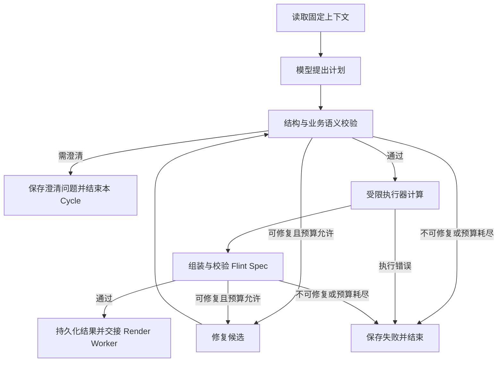

# LangChain / LangGraph 选型研究

> 状态：M1-A 已采用百炼千问原生 HTTP 基线；LangChain / LangGraph 仍是后续内部实现选项，不是当前运行时依赖。核对日期：2026-09-06。
> 本文核对 JavaScript / TypeScript 官方文档和 TypeScript 源码；没有安装依赖、调用真实模型或运行框架集成测试。源码链接指向研究时的 `main`，实施时必须锁定发行版本并重新验证。

## 1. 本轮边界与既有入口

Outcome：为咨询顾问的一次 Generation Cycle 选择多供应商调用与后续编排方案。
Aggregate：Project 内的 Generation Job / Generation Cycle；仍只使用一个 Data Snapshot，生成一个主 Chart Artifact / Evidence Block。
In scope：给出百炼千问、DeepSeek、OpenAI 的 LangChain 适配方案、失败记录、预算和数据发送边界。
Out of scope：本轮不安装框架、不更换 Worker、不启用外部追踪、不改变记忆确认和 Review 规则。
Proof：交叉检查既有文档、入口和官方 TS API；具体模型能力必须在实施阶段用固定样例验证。

当前 Worker 同步调用 [`generateArtifacts()`](../apps/generation-worker/src/index.ts)，生成模块仍用规则理解问题和创建计划；仓库尚未声明 LangChain / LangGraph 依赖。调用层应放进既定 [Model Gateway 方案](./model-gateway-implementation-plan.md)，外部框架类型保持在 Gateway 内部。

本项目已确认的首期运行边界是：只生成 `chart-plan`，首期历史上下文策略为 `canonical_text_context`。Conversation 保存用户可见历史；Generation Cycle 固化 Data Snapshot、Analysis Brief、Metric Definition、Theme、路由和提示词版本；未来 LangGraph checkpoint 只保存执行恢复状态。模型切换发生在当前 run 完成后，并在同一 Conversation 下创建新的 Generation Cycle；切换不会改写旧消息或旧 Cycle。

跨供应商调用不直接回放供应商私有字段。Gateway 先把确认后的 Brief、指标、字段画像、必要统计和脱敏文本投影为规范上下文，再由目标 Profile 的适配器生成请求。首期不回放 reasoning、tool call、thought signature 或图片。未来通用 Agent 需要全量历史时，必须增加带版本和哈希的 `HistoryAdapter`，不能把任意 LangChain 消息直接发送给另一个供应商。

## 2. LangChain 模型组件能带来什么

LangChain 的模型组件统一消息、`invoke` / `stream` / `batch` 和结构化输出的调用方式，并允许附加 callbacks、tags、metadata。不同供应商仍有专属参数和输出差异，统一接口不能替代兼容性测试。[JS 模型指南](https://docs.langchain.com/oss/javascript/langchain/models)

建议首批直接使用 `@langchain/core`、`@langchain/openai`、`@langchain/deepseek`；仅为模型调用无需引入 `createAgent`。OpenAI 和 DeepSeek 官方 JS 集成分别给出集成包加 core 的安装方式。[OpenAI 集成](https://docs.langchain.com/oss/javascript/integrations/chat/openai)、[DeepSeek 集成](https://docs.langchain.com/oss/javascript/integrations/chat/deepseek)

项目收益是减少消息封装、输出提取、流式事件和供应商接入的重复代码；业务继续拥有 `generateStructured()` 合同、Model Profile、权限、预算、调用审计和本地校验。新增模型的验收责任不会转移给框架。

## 3. 首批供应商的具体适配

| Connection | 建议模型组件 | 明确控制的能力 |
| --- | --- | --- |
| 百炼千问 | 首选原生 HTTP / OpenAI SDK 基线；验证通过后可在 Gateway 内用 `ChatOpenAI` 加 `configuration.baseURL` | 读取控制台实际端点、地域和模型 ID；按 Profile 选择 `jsonSchema` 或 `jsonMode`；高级能力不以兼容接口自动推断 |
| DeepSeek 官方 | `ChatDeepSeek`，来自 `@langchain/deepseek` | 首版显式指定 `jsonMode`，再按已验证模型能力开放工具调用 |
| OpenAI 官方 | `ChatOpenAI({ useResponsesApi: true, ... })` | 显式走 Responses；使用经过验证的结构化输出和数据保留参数 |

百炼的 OpenAI 兼容接口要求对应的 API Key、Base URL 和模型名称；具体地址按业务空间和地域获取，不把一个固定公共地址写死进适配器。[百炼兼容接口](https://help.aliyun.com/zh/model-studio/compatibility-of-openai-with-dashscope)

百炼 JSON Object 和 JSON Schema 的支持范围不同，部分模型的思考模式也影响结构化输出。Profile 应绑定供应商、端点、模型版本和模式，不能仅根据名字包含 `qwen` 开启严格 Schema。[百炼结构化输出](https://help.aliyun.com/zh/model-studio/qwen-structured-output)

`ChatDeepSeek` 的 TS 实现继承 `ChatOpenAICompletions`，处理 DeepSeek 特定响应；其 `withStructuredOutput` 未指定方法时默认 `functionCalling`。因此本项目若选择 JSON Object，必须写明 `method: "jsonMode"`，不能依赖默认值；这也不代表所有 DeepSeek 当前或未来模型都只支持 JSON Object。[DeepSeek TS 源码](https://github.com/langchain-ai/langchainjs/blob/main/libs/providers/langchain-deepseek/src/chat_models.ts)

DeepSeek 官方 JSON Output 要求提示词包含 JSON 并给出格式示例；文档提示可能出现空内容和输出截断。两种情况都应作为失败处理，不能保存空计划。[DeepSeek JSON Output](https://api-docs.deepseek.com/guides/json_mode/)

### 3.1 Chat Completions 与 Responses 的陷阱

`ChatOpenAI` 支持显式 `useResponsesApi: true`，但 `false` 并不是禁止 Responses：当前 TS 实现还会根据内置工具、`previous_response_id`、`text`、`truncation`、推理摘要和模型偏好等条件自动选择 Responses。兼容 Chat Completions 的端点不能接收未经筛选的共享调用参数。[协议选择 TS 源码](https://github.com/langchain-ai/langchainjs/blob/main/libs/providers/langchain-openai/src/chat_models/index.ts)

当前源码公开导出 `ChatOpenAICompletions` 和 `ChatOpenAIResponses`。首版若选择前者固定百炼协议，要确认锁定的 npm 发行包确实有该导出；本轮没有安装验证。不要为了使用它导入包内部路径。[包入口 TS 源码](https://github.com/langchain-ai/langchainjs/blob/main/libs/providers/langchain-openai/src/index.ts)

LangChain 官方提醒，`ChatOpenAI` 面向 OpenAI 规范，代理或供应商专用响应字段可能没有保留。Gateway 仍应测试缓存用量、结束原因、请求 ID 等字段；缺失字段记为未知，不能凭空补零或推断。[兼容接口注意事项](https://docs.langchain.com/oss/javascript/langchain/models#base-url-and-proxy-settings)

因此，百炼的原生调用是首期可用基线，LangChain 只是可替换的内部适配实现；如果 LangChain 不能保留千问所需字段或结构化输出能力，直接使用已审计的 HTTP / SDK Adapter，不扩大业务层的供应商分支。

## 4. 结构化输出和审计

推荐沿用项目 Zod 契约，在 Gateway 明确选择 `jsonSchema`、`functionCalling` 或 `jsonMode`。Zod 会参与运行时验证；直接传普通 JSON Schema 的通用解析器不做同等的本地 Schema 验证，因此仍须执行项目自己的校验。[结构化输出 TS 实现](https://github.com/langchain-ai/langchainjs/blob/main/libs/langchain-core/src/language_models/structured_output.ts)

`jsonMode` 不应传 `strict`；当前 OpenAI TS 实现会对此抛错。`strict` 和 Schema 子集是否可用必须由具体 Profile 决定。网络重试不能修复一个根本不支持该参数的模型。[OpenAI 结构化输出 TS 实现](https://github.com/langchain-ai/langchainjs/blob/main/libs/providers/langchain-openai/src/chat_models/base.ts)

使用 `includeRaw: true` 可获得 `raw` 和 `parsed`。当前 TS 通用管道在解析失败时可能返回 `parsed: null`，而类型签名未充分表达空值；不能照搬 Python 的 `parsing_error` 字段，也不能只靠 `catch` 识别失败。[结构化输出管道 TS 实现](https://github.com/langchain-ai/langchainjs/blob/main/libs/langchain-core/src/language_models/structured_output.ts)

Gateway 应先保存经过数据策略处理的原始模型消息，再对 `parsed` 做非空和 Zod 校验；解析失败时从原始文本或工具参数进行一次本地诊断，保存具体错误。遇到 SDK 在消息生成前抛出异常，单独记录错误和可用元数据；`includeRaw` 不保证所有失败都已有 `raw`。

下面仅展示已核对的方法形状；它不是已经编译通过的项目实现：

```ts
const structured = model.withStructuredOutput(planSchema, {
  method: profile.structuredOutputMethod,
  includeRaw: true,
  ...(profile.structuredOutputMethod === "jsonSchema" ? { strict: true } : {}),
});
const result = await structured.invoke(messages, {
  signal,
  callbacks: [localAuditCallback],
  metadata: { generationJobId, modelProfileVersion },
});
await saveModelMessage(result.raw);
if (result.parsed == null) {
  throw await diagnoseOutputFailure(result.raw);
}
const plan = planSchema.parse(result.parsed);
```

最后还要检查引用字段、操作白名单、Metric Definition、时间规则和字段血缘，再让受限执行器计算真实数值。结构匹配不能证明计划或结论正确；模型不直接生成可信的图表数值，也不能直接创建 Approved Revision。

## 5. 重试、取消与用量

当前 LangChain `AsyncCaller` 默认允许最多 6 次重试。建议模型构造时显式 `maxRetries: 0`，由 Gateway 为每次请求分配预算和记录，再决定可否重试，避免框架、任务和修复层各自累加。[AsyncCaller TS 实现](https://github.com/langchain-ai/langchainjs/blob/main/libs/langchain-core/src/utils/async_caller.ts)

不能泛称当前 LangChain 必然与底层 SDK 重试相乘：已核对的 OpenAI 适配实现会把 SDK 默认重试置零，并将单次调用的重试参数交给自己的 caller。本项目仍需对锁定版本和自定义配置验证实际 HTTP 尝试数。[OpenAI 客户端初始化](https://github.com/langchain-ai/langchainjs/blob/main/libs/providers/langchain-openai/src/chat_models/base.ts)、[Completions 重试实现](https://github.com/langchain-ai/langchainjs/blob/main/libs/providers/langchain-openai/src/chat_models/completions.ts)

`invoke(input, { signal })` 的信号应传到底层请求；不能只用外层 `Promise.race` 声称已取消。当前 Completions 实现传递 `signal`，而 core 的通用竞争等待本身不能取消底层工作；实施时对三条适配路线分别验证中止行为。[Completions 请求实现](https://github.com/langchain-ai/langchainjs/blob/main/libs/providers/langchain-openai/src/chat_models/completions.ts)、[AsyncCaller 取消说明](https://github.com/langchain-ai/langchainjs/blob/main/libs/langchain-core/src/utils/async_caller.ts)

建议设置单次调用超时和整个 Cycle 截止时间。瞬时网络错误和可恢复限流可在总预算内重试；鉴权失败、未知模型、非法参数直接停止。模型修复仍遵守最多两轮；供应商或模型的更换由用户发起，并通过新的 Generation Cycle 完成。

正常响应可从 `AIMessage.usage_metadata` 读取供应商提供的输入和输出用量；流式 `handleLLMNewToken` 适合进度显示，不等于计费统计。Gateway 分开记录供应商实报、估算和未知，不把估算当账单。[消息元数据与流式回调实现](https://github.com/langchain-ai/langchainjs/blob/main/libs/providers/langchain-openai/src/chat_models/completions.ts)

部分兼容服务不支持 `stream_options`，可按 Profile 使用 `streamUsage: false`；此时不能假定流末尾仍有准确 Token 用量。首版计划生成建议非流式，只向前端发送可信的阶段进度。[流式用量兼容说明](https://docs.langchain.com/oss/javascript/integrations/chat/openai#disabling-streaming-usage-metadata)

## 6. LangSmith 和数据发送边界

LangSmith 追踪是可选能力，官方文档通过环境变量和 API Key 开启自动追踪。建议生产默认不启用，使用本地审计；启动时核对继承的环境和 callbacks，不能认为没有在本文件里配置就一定不会发送。[LangChain 追踪接入](https://docs.langchain.com/langsmith/trace-with-langchain)

若后续启用，要把 LangSmith 作为独立数据接收方纳入 Workspace / Project 策略。官方支持 `LANGSMITH_HIDE_INPUTS`、`LANGSMITH_HIDE_OUTPUTS` 和 TS Client 的 `hideInputs` / `hideOutputs`；隐藏输入输出并不会自动消除 metadata 中的数据。[追踪脱敏](https://docs.langchain.com/langsmith/mask-inputs-outputs)

模型上下文、原始模型输出、本地审计和追踪分别制定保留规则。客户文件行、脱敏前样本、密钥和业务结论不放进 tags / metadata；callbacks 的失败和关机刷新也需有明确处理，不让外部可观测服务决定 Evidence Block 能否持久化。

## 7. 模型组件接入的验收门槛

1. 三条 Connection 用同一固定销售数据样例生成可执行计划，实际聚合数值、字段和口径匹配预期。
2. 通过模拟 HTTP 核对端点、请求字段、Schema 模式和实际调用次数；协议不会因共享参数意外切换。
3. 空响应、截断、拒绝、非法 JSON、`parsed: null`、Schema 不匹配都保留可解释的失败记录。
4. 取消、超时、限流、Worker 重领任务都遵守总预算和幂等规则；不会重复创建 Chart Revision。
5. 逐条核对供应商请求 ID、用量和缓存字段的实际保留情况；缺失信息显式记为未知。
6. 固定依赖版本、模型配置、Schema 和提示词版本后再灰度；升级必须重新跑相同评测集。

## 总体选型建议

M1-A 先采用 **项目自有 Model Gateway + 原生 HTTP + 现有有限 Worker 流程**。百炼兼容接口的端点、结构化输出、`enable_thinking`、请求 ID、用量和完成原因均需精确审计，当前直接请求比加入框架更容易验证这些字段。后续当第二家供应商的重复适配成本已经有真实证据时，LangChain 可以只在 Gateway 内替换客户端；不得扩散其消息类型或隐式重试到业务层。需要跨进程阶段恢复、多个条件分支或流程图调试时，再评估 LangGraph。

| 选择 | 对 LangReport 的主要收益 | 新增成本与适用条件 |
| --- | --- | --- |
| 自有 Gateway + 原生 SDK/HTTP | 最直接地保留供应商能力，方便检查真实请求 | 自己维护消息、结构化输出、用量和错误映射；少量固定模型时仍是合理备选 |
| 自有 Gateway + LangChain 模型组件 | 复用模型客户端、消息、结构化输出、回调接口；以后增加模型任务时可复用 | 需要锁定依赖、核对参数映射和协议选择；当前首选 |
| LangGraph + 自有 Gateway（内部可用 LangChain） | 显式节点、分支、持久化恢复和执行历史，适合增长后的生成流程 | 需要设计 Checkpoint、业务状态同步、节点重放和版本迁移；在明确需要恢复/分支能力时引入 |
| LangChain 高层 Agent | 适合模型自行决定工具调用顺序的任务 | 首阶段生成顺序、操作集合与修复次数已由产品约束，当前无需自动工具循环 |

这个判断来自当前代码与产品约束，而非模型质量基准。现有 [generateArtifacts](../packages/generation/src/index.ts) 已包含顺序生成、执行和有限修复；[Generation Worker](../apps/generation-worker/src/index.ts) 负责领取任务与阶段状态；[Render Worker](../apps/render-worker/src/index.ts) 独立渲染和生成 Revision。暂未实测引入框架后的耗时、费用和依赖开销，不能把统一接口等同于质量提升或成本下降。

如果团队本轮决定优先建设“Worker 重启后从已完成阶段恢复”，可以直接选择 LangGraph + LangChain 模型组件，但恢复与幂等测试应进入首个交付。仅为了支持三家模型，LangGraph 并非必要依赖。

## 代码落点与替换边界

继续使用 [多供应商接入计划](./model-gateway-implementation-plan.md) 的 Connection / Protocol / Model Profile / Task Route 和统一 ModelRequest / ModelResult。此次建议只改变 Gateway 内部实现选项，不将 LangChain 类型扩散到领域对象。Model Profile、HistoryAdapter、提示词、Schema、数据策略和执行器都必须有版本；这些版本随 Generation Cycle 固化。

- 拟新增的 `packages/model-gateway`：将 LangChain 客户端、消息构造与结构化输出封装在内部。对外只暴露本地合同，负责脱敏、允许的目的地、模型能力、预算和调用记录。
- [Generation](../packages/generation/src/index.ts)：调用 Gateway 获得计划，先做独立的模型计划结构/业务校验，再使用现有受限执行器和校验器。校验后再组装真实数据与固定主题；渲染完成后执行独立的渲染产物校验。
- [Generation Worker](../apps/generation-worker/src/index.ts)：继续原子领取任务、检查权限与固定版本、推进数据库状态。选择 LangGraph 时由它调用编译后的工作流。
- [API](../apps/api/src/routes.ts)、[HTTP 契约](../packages/contracts/src/http.ts)、[Web](../apps/web/app/page.tsx)：继续面向 Generation Job、澄清问题和 Revision，不暴露模型厂商响应或 Graph 内部对象。`localStorage` 只能保存界面偏好，服务端负责校验 Profile、当前 run 和 Project 授权。
- [Memory](../packages/memory/src/index.ts)：使用现有 Candidate 确认流程。Checkpoint 或聊天消息历史不会自动成为 Project Memory。
- Render Worker：继续拥有渲染和业务 Revision 写入；执行图完成不代表 Evidence Block 已成功生成。

依赖采用 Node.js / TypeScript 路线，与现有仓库一致。首轮只在 Gateway 包评估 `@langchain/core`、`@langchain/openai` 及需要的供应商包；核对锁定版本与项目 Zod/ESM/TypeScript 的兼容性。启用 LangGraph 时再增加 `@langchain/langgraph` 和生产 Checkpointer；不需要为此另建 Python 服务或接入托管 Agent 平台。

## 采用 LangGraph 时的具体处理

### 用确定的工作流表达生成规则

LangGraph 同时支持固定路径工作流和动态 Agent。LangReport 当前更适合前者，将模型节点和确定性节点显式组合。[Workflows and agents](https://docs.langchain.com/oss/javascript/langgraph/workflows-agents)。

建议的编排边界如下，所有节点名称均为拟定：



首版执行错误进入可解释失败；确认可修复的类型以后才能路由到修复节点。所有模型调用仍经过 Gateway，修复节点也遵守累计预算。模型能力不足或工具调用失败时，系统展示降级/失败原因和可选模型，等待用户切换；不自动切换供应商。用户选择新模型后创建新的 Generation Cycle。交接节点将 Generation Job 置为 rendering 后结束 Graph，Render Worker 完成真实渲染和版本保存后才能置为 succeeded。

如果正式采用 LangGraph，优先 Graph API：节点和条件边可以直接对应产品阶段与修复规则。若仅给现有顺序函数添加恢复能力，可先评估 Functional API；两者共享运行时，后者改动通常更小。[Graph / Functional API 选择](https://docs.langchain.com/oss/javascript/langgraph/choosing-apis)。

### 状态、Checkpoint 与业务记录分工

| 状态位置 | 存放什么 | 权威范围 |
| --- | --- | --- |
| Generation Job / Chart Revision 等业务表 | 固定输入、业务阶段、结果、审核、版本、实际调用预算 | 用户可见状态和业务事实 |
| Graph State / Checkpoint | 当前节点、结果引用、校验结果引用、图版本和恢复位置 | 内部流程恢复 |
| 私有对象存储 | 原始数据、完整变换结果、计划与渲染产物 | 大对象的版本化内容 |
| Gateway 调用记录 | 每次实际发送、供应商响应状态、用量、切换和修复信息 | 调用审计与预算核对 |

Graph State 保持小且可序列化，只保存 Snapshot ID、上下文/计划/变换结果/校验对象的引用及哈希等必要信息；原始数据行、密钥、SDK 客户端和数据库连接不进入 Checkpoint。Graph State 中的计数只作执行快照，费用与实际发送次数由持久化调用记录约束，重放旧 Checkpoint不能重置预算。

生产可使用 PostgreSQL Checkpointer，与业务表区分表空间/Schema、生命周期和访问权限。默认先评估同步持久化以减少节点间丢失状态的窗口；同步 Checkpoint 仍不等于供应商请求与业务事务原子提交。内存 Checkpointer 只用于测试。官方提供 `@langchain/langgraph-checkpoint-postgres`。[Checkpointers](https://docs.langchain.com/oss/javascript/langgraph/checkpointers)。

服务端生成 `thread_id`，将它绑定到 Workspace / Project / Generation Job；不要直接用 Conversation ID 跨多个 Cycle 共享执行状态。ID 命名不替代权限检查，恢复与读取状态时仍验证 Project 权限。新 Cycle 使用新 ID；图版本、提示版本、模型路由和执行器版本随任务固定。

### 恢复、写入与双重状态

以下规则属于 LangReport 的实现设计：

1. 业务事务先保存阶段结果、结果引用和带幂等键的阶段完成标记。Checkpoint 更新失败后，重跑节点先查询完成标记并复用结果。
2. 使用现有任务领取机制并补足租约/心跳与 fencing token；Checkpoint 本身不替代并发领取控制。
3. 模型调用保存独立 invocationId 及输出。恢复已完成节点优先复用已保存输出；发送后尚未记录响应就崩溃时，标记结果未知并按剩余预算处理，不能承诺零重复调用或零重复计费。
4. 渲染交接写入采用条件更新；重复交接不得把 succeeded 回退为 rendering。现有 Render Worker 的 advisory lock 和 Revision 唯一约束继续生效。
5. 普通恢复沿用图版本及输入。主动调试重放可能重新触发外部调用，应使用合成数据/独立测试任务；不得拿生产 Approved Revision 做可写试验。
6. HTTP、SDK/LangChain、Graph 节点和 Worker 的重试统一分配；修复计数仍最多两轮，Graph 的递归/步数上限只作为额外保险。
7. 图状态与业务状态不一致时，以持久化的业务完成标记和产物验证结果决定后续动作；定时恢复逻辑处理失效租约和未完成节点，不能只靠页面重新触发。
8. 发布新版图时保存旧任务所需的版本；更改节点名、状态 Schema、Reducer 或序列化格式前验证已有 Checkpoint 的恢复，避免新代码误读旧状态。

官方说明重放会重新执行目标 Checkpoint 后面的节点，也可能重新调用模型；中断恢复会从节点开头重跑。重复执行的外部写入应具备幂等性。[Checkpoint 重放](https://docs.langchain.com/oss/javascript/langgraph/checkpointers)、[Interrupts](https://docs.langchain.com/oss/javascript/langgraph/interrupts)。

### 人工参与遵循现有领域规则

LangGraph 的 interrupt/resume 适合需要人工输入的工作流，但当前 [Agent Loop 规范](./agent-loop-spec.md) 明确要求：Needs Clarification 后，用户补充信息创建新的 Generation Cycle。因此本项目的澄清路径应保存问题并结束原图；新的确认输入进入新的 Job 和图实例。模型降级、工具调用失败和不兼容历史同样通过用户可操作的提示结束当前 Cycle，不能在同一 Cycle 内偷偷改变模型。

Review 继续针对固定 Evidence Block / Chart Revision，由现有 Reviewer 权限、状态转移和审计处理。首版不把审核包进一个长时间挂起的生成图。以后需要在不改变固定输入的前提下暂停某个执行动作时，再设计 interrupt 的恢复授权和过期规则。

## 迁移、验证与交付顺序

| 顺序 | 本轮结果 | 必须通过的检查 |
| --- | --- | --- |
| 1 | LangChain 封装一个已允许的百炼 Profile，跑通一个 Evidence Block | 请求路径/参数、成功/空响应/非法 JSON、Schema 解析、真实指标数值、用量记录；只发送必要数据 |
| 2 | 增加 DeepSeek 和 OpenAI Profile，复用同一业务合同 | 使用原多供应商计划的评测集，确认协议不会被 SDK 自动切换；未知能力显式拒绝 |
| 3 | 比较 LangChain 封装与可用的原生调用基线 | 检查缺失响应字段、错误映射、实际发送次数、取消行为、时延和成本；关键能力不足时保留对应原生适配 |
| 4（满足引入条件后） | 将 Generation 的内部编排迁入 LangGraph | 节点条件与原行为一致，修复不超预算，交接 rendering 后不提前宣告业务成功 |
| 5（随 LangGraph 上线） | PostgreSQL Checkpointer 与恢复 | 注入模型返回后崩溃、业务提交后 Checkpoint 失败、重复领取、重复交接；检查不产生重复 Revision，已记录调用预算不回退 |

所有真实模型检查需使用已开通的模型与合成数据；本研究未安装依赖、未执行三家接口。类型检查和集成测试以届时实际 package scripts 为准。业务 API/UI 状态有变更时同步 HTTP 契约，并执行仓库规定的 UI 验证与 typecheck。

LangSmith 是可选的观察与评测工具。生产开启外部追踪前检查回调实际包含的消息、样本、模型输出、工具参数和错误；先脱敏，再按项目数据目的地策略启用。Trace 不能替代数据库中的不可变业务审计。Checkpoint 同样需要租户隔离、访问控制、保留期限和清理策略。

本次交付为官方资料核对与选型建议；尚未对框架版本、供应商能力或性能作真实集成验收。首个建议实施结果仍为：一个固定销售 Snapshot，经 LangChain 封装的 Gateway 生成一个口径正确、可追溯的 Draft Evidence Block。

## LangChain 版本建议

如果本项目现在开始引入，选择 **LangChain.js v1.x 主线**，不要从旧的 v0.x API 开始。官方 v1 将 `createAgent` 定义为标准 Agent 入口，并将旧版链和其他遗留能力迁移到 `@langchain/classic`；这意味着新代码若沿用旧 API，后续仍要承担一次迁移成本。[LangChain v1 发布说明](https://docs.langchain.com/oss/javascript/releases/langchain-v1)、[v1 迁移指南](https://docs.langchain.com/oss/javascript/migrate/langchain-v1)

本项目的首个实现不必安装 `langchain` 总包或调用 `createAgent`。建议只在 `packages/model-gateway` 中引入与 v1 兼容的基础和供应商包：

```text
@langchain/core
@langchain/openai
@langchain/deepseek
```

百炼、DeepSeek 和 OpenAI 的调用都经过自己的 Gateway、Zod 合同、超时/重试预算和调用审计；LangChain 只负责模型接口、消息和结构化输出适配。安装时把每个包锁定到实际验收过的精确版本，提交 `pnpm-lock.yaml`，不要依赖 `latest` 或混用 v0.x 与 v1.x 的 API。

只有在 Generation Cycle 需要节点级恢复、条件分支、人工暂停或跨进程续跑时，才增加与 LangChain v1 兼容的 `@langchain/langgraph`；两者独立锁定版本和 peer dependencies，生产持久化再增加匹配的 PostgreSQL Checkpointer。LangGraph v1 与 LangChain v1 的关系和迁移变化见[官方 LangGraph v1 发布说明](https://docs.langchain.com/oss/javascript/releases/langgraph-v1)。
