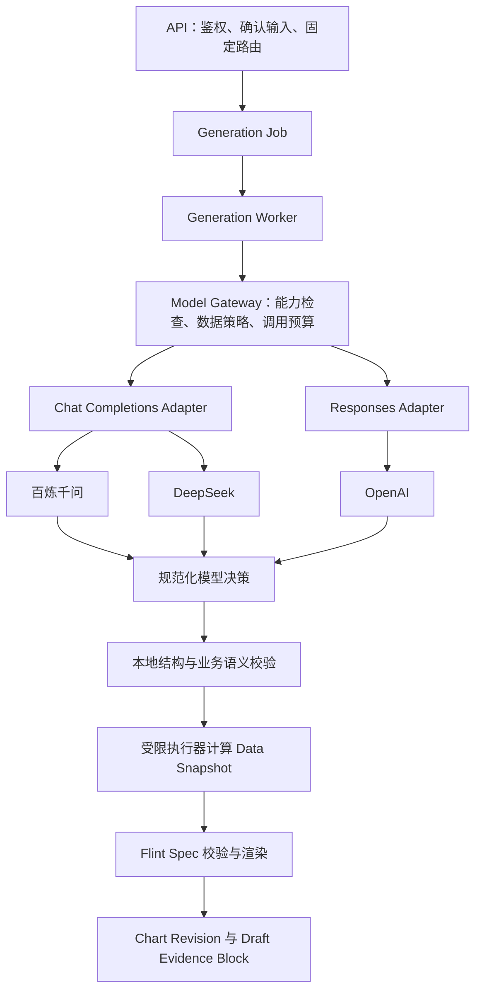

# 多供应商模型接入实施计划

状态：M0-A/B/C 与确定性 Generation Cycle seam 已实施；M1 及后续里程碑待实施。用户已确认首批供应商为百炼千问、DeepSeek、OpenAI。本文中的真实供应商接口、配置、数据字段和验收门槛仍是方案，尚未表示已通过真实模型验证。核对日期：2026-09-06。

目标：顾问在一个 Project 内使用一个 Data Snapshot 和已确认的 Analysis Brief、Metric Definition，经任一已启用模型生成一个可追溯的 Draft Evidence Block。切换模型不改变数据计算、字段血缘、图表校验和审核规则。

主要领域边界为 Generation Cycle / Generation Job。范围遵循 [第一阶段产品规格](./phase1-consulting-report.md)；术语遵循 [CONTEXT](../CONTEXT.md)；执行限制遵循 [Agent Loop 规范](./agent-loop-spec.md)。统一网关及数据最小化沿用 [ADR 0006](./adr/0006-data-minimization-and-model-gateway.md)。本轮只把确定性路径收口到 `GenerationCycle` seam，并保存判别结果与审计；不调用真实供应商、不安装 LangGraph、不自动故障切换。

已确认的首期策略：模型切换由用户发起，不自动故障切换；能力降级或工具调用失败时向用户展示原因和可选模型，用户选择后创建新的 Generation Cycle。首期上下文策略固定为 `canonical_text_context`，只向目标模型发送规范化的 Brief、指标和必要的脱敏文本，不直接回放供应商私有历史字段。用户补充澄清信息后也创建新的 Generation Cycle；原 Cycle 的输入、模型和失败原因保持不变。

## 1. 代码事实与接入前提

| 位置 | 已有行为 | 实施时需要补齐 |
| --- | --- | --- |
| [Web](../apps/web/app/page.tsx) `generateEvidence` | 创建 Generation Job 并轮询 | 澄清状态、允许选择的模型配置、实际使用模型与失败原因 |
| [API](../apps/api/src/routes.ts) `createGenerationJob` | 固定 Snapshot、指标、Brief、主题等输入 | 模型路由快照、明确的指标选择与 Brief 确认；当前自动创建的 Brief 缺少时间信息却被标记 confirmed |
| [Generation Worker](../apps/generation-worker/src/index.ts) | 读取 Snapshot 并持久化 Cycle 结果 | 继续补齐真实网关调用、Worker 租约和调用记录 |
| [Generation](../packages/generation/src/index.ts) `GenerationCycle` | 通过确定性 adapter 包装关键词意图、规则计划、计算、Flint Spec、最多两轮规则修复 | 替换 adapter 为真实 Model Gateway，并保留明确的输出字段映射和统一修复预算 |
| [Contracts](../packages/contracts/src/index.ts) | Zod 定义 TransformPlan / Flint Spec | 模型决策 Schema、模型选择请求与可展示状态 |
| [DB](../packages/db/src/schema.ts) | 保存业务输入、生成结果、Cycle 审计和 `needs_clarification` 状态 | 真实调用记录、执行租约和 fencing token |

还需处理四个会影响生成正确性的事实：

- `analysisBriefSnapshot`、`metricDefinitionSnapshot`、`memoryContext` 现在由 Worker 传入 `GenerationCycle`；Worker 优先消费 Job 已固化的 Memory，缺失时只为历史 Job 做兼容性检索，防止正常排队任务受项目记忆变化影响。
- 当前 API 选取项目最新 confirmed 指标。接入后需要解析用户明确选择的指标；有多个候选且无法唯一对应时澄清，不能以“最新”代替业务相关性。
- `generateFlintSpec` 偏向第一项指标和 `${measure}_sum` 字段。模型返回不同输出名或要求把同比作为纵轴时，需要显式传入经校验的图表字段映射，避免重新猜测。
- [Render Worker](../apps/render-worker/src/index.ts) 的 `buildFinding` 使用预览数据。截断预览不能用于断言全量最大值或总数据点数；首批接入应由完整变换结果计算事实摘要，再生成确定性发现文本。

产品规格的语义操作名称与执行契约分层处理：当前执行器支持 `filter / derive / aggregate / sort / limit`，产品规格还要求选择、重命名、转换类型等能力。生成提示词只暴露本次验证可执行的操作。未支持的操作返回可解释结果；后续通过显式编译映射或版本化扩展契约实现，不能宣称所有第一阶段变换已完成。

## 2. 架构与职责



首版新增 `packages/model-gateway` 工作区包，使用进程内库，不新增独立网关服务。业务生成策略留在 `packages/generation`；网关只负责供应商通信、能力和策略执行。当前建议优先评估 LangChain TypeScript 模型组件作为两个协议适配器的内部实现，对无法完整支持的供应商参数保留受控 SDK/HTTP 路径；业务代码不导入框架或供应商 SDK 类型。关闭各层隐式重试，由网关统一计数。具体收益、准入测试和 LangGraph 引入条件见 [LangChain / LangGraph 选型研究](./langchain-langgraph-selection.md)。这一建议尚未改变运行代码。

明确分开以下四种工程配置，它们不新增 Project 业务实体：

| 配置 | 表达什么 | 示例 |
| --- | --- | --- |
| Connection | 实际服务提供方、端点、地域、凭据引用、允许的 Workspace | `bailian-cn`、`deepseek-direct`、`openai-direct` |
| Protocol | 请求和响应的传输格式 | `chat-completions`、`responses` |
| Model Profile | Connection + 实际模型 ID + 参数 + 已验证能力 + 版本 | `bailian-planner-v1`、`openai-planner-v1` |
| Task Route | 某种业务任务允许选哪些 Profile | `chart-plan` 的默认模型与用户可选择模型 |

同名 DeepSeek 模型经百炼托管和经 DeepSeek 官方调用，是不同 Connection：密钥、数据接收方、配额、价格与能力需要分别验证。Profile 不能仅以模型名字为键。

## 3. 按能力适配，按模型验证

以下是首批协议选择，能力以具体模型、模式、端点及验证版本为准：

| 供应商 | 首版适配 | 结构化输出 | 需要独立处理的差异 |
| --- | --- | --- | --- |
| 百炼千问 | Chat Completions | 已支持模型用 JSON Schema；其他经过评测的模型可用 JSON Object | 地域与 API Key 匹配、业务空间域名、模型开通、思考参数、输出长度参数 |
| DeepSeek | Chat Completions | 首版采用 JSON Object 并执行本地严格校验 | JSON 提示要求、空 content、截断、推理模式、用量字段；官方 Responses 可另建 Profile 验证 |
| OpenAI | Responses | 支持的模型使用 `text.format` JSON Schema | `input/output` 格式、refusal/incomplete、推理和用量、数据存储参数 |

百炼文档明确区分 JSON Object 与 JSON Schema 的能力和模型范围，且 API Key 与端点地域有关。[结构化输出](https://help.aliyun.com/zh/model-studio/qwen-structured-output)、[接口与地域配置](https://help.aliyun.com/zh/model-studio/compatibility-of-openai-with-dashscope)。

DeepSeek Chat 的 JSON 模式要求在提示中说明 JSON，并处理可能为空或截断的内容；其官方 Responses 接口也有 JSON Schema 格式，首版协议选择不限制后续使用它。[JSON Output](https://api-docs.deepseek.com/guides/json_mode/)、[Responses API](https://api-docs.deepseek.com/api/create-response/)。推理模式下部分采样参数可能无效，因此应保存实际生效的参数。[Thinking Mode](https://api-docs.deepseek.com/guides/thinking_mode/)。

OpenAI Responses 的结构化输出配置与 Chat Completions 字段不同，拒绝和不完整结果也需要独立分支处理。[Structured Outputs](https://developers.openai.com/api/docs/guides/structured-outputs)。

每个 Model Profile 至少记录：

- `connectionId`、`protocol`、`modelId`、`profileVersion`、`adapterVersion`。
- 支持的输出模式、Schema 子集、上下文/输出限制、长度限制参数及其语义。
- 可用的推理模式、推理强度与采样参数组合；未支持的必需能力应在发送前报错。
- 是否支持流式、取消和用量返回；缺失用量保持 unknown，不能记成零。
- `verifiedAt`、验证报告引用、启用状态和可承担的任务。
- 价格表引用及版本、币种、输入/输出/缓存/推理 Token 的计费映射。
- 首期上下文策略、HistoryAdapter 版本（固定为 `canonical_text_context`）和兼容的消息能力。

模型目录接口可帮助发现 ID，但不能证明结构化输出、参数或质量。只有完成探测和领域评测的 Profile 才能进入任务路由。首版不把 `latest` 或模型列表的第一项自动设为生产模型。

## 4. 统一输入与输出合同

首版只接 `chart-plan` 任务，将意图、TransformPlan 和图表字段选择合并为一次结构化请求。发现文本先使用确定性事实摘要；普通对话、模型发现文本和记忆提取另行迭代，复用网关但使用独立 Schema 与预算。

下面是类型草图，实施时在仓库中补齐具体 Schema；`T` 只有经过本地解析器和业务校验后才能作为成功结果返回。持久化请求描述不能包含解析函数或 `AbortSignal` 等运行时对象，二者在 Worker 内部组装。

```ts
type PersistedModelRequest = {
  workspaceId: string;
  projectId: string;
  generationJobId: string;
  invocationId: string;
  task: "chart-plan";
  routeSnapshotId: string;
  context: PreparedModelContext;
  output: {
    schemaId: string;
    schemaVersion: string;
    jsonSchema: Record<string, unknown>;
  };
  budget: { deadlineAt: number; maxOutputTokens: number };
};

type RuntimeModelRequest<T> = PersistedModelRequest & {
  output: PersistedModelRequest["output"] & {
    parse: (value: unknown) => T;
  };
  signal: AbortSignal;
};

type ModelResult<T> =
  | { status: "ok"; data: T; invocationId: string }
  | {
      status: "error";
      code: ModelErrorCode;
      retryable: boolean;
      invocationId: string;
    };

interface ModelGateway {
  generateStructured<T>(request: RuntimeModelRequest<T>): Promise<ModelResult<T>>;
}
```

`PreparedModelContext` 是专门构造的发送对象，只包含：确认后的 Brief 和指标快照、固定的相关记忆、字段类型与必要统计、经过处理的少量样本、可用操作、允许的图表类型、必要的模板限制。首期 `canonical_text_context` 不包含旧模型的 reasoning、tool call、thought signature、供应商私有字段或未经授权的图片。Workspace/Project/Job ID 用于本地策略与审计，不因处于请求对象中就自动发往供应商。

`HistoryAdapter` 的职责是把 Conversation 的规范消息投影为目标 Profile 可理解的上下文，并返回投影版本和哈希。首期只实现 `canonical_text_context`；将来增加全量多轮 Agent 时，仍须由目标适配器决定字段保留、角色重排、工具结果和多模态内容转换。

模型决策的领域 Schema 使用对象外壳，包含 `decision: ready | needs_clarification`、`intent`、`plan`、`chartSelection`、`questions`。ready 时计划和字段选择必填且问题为空；needs_clarification 时计划为空且问题非空。本地通过联合类型或交叉字段验证保证互斥；传输 Schema 根据供应商子集转换，保留原始完整校验。

`chartSelection` 明确声明变换后的横轴、纵轴、系列、提示字段和 Line/Bar/Area 类型。系统在执行后逐一验证字段，并自行装入 `transform.rows`、Theme 及固定模板版本。模型不返回原始数据、计算结果数组、任意代码或可执行图表配置。

Schema 处理顺序固定为：

1. 从本地 Zod 契约产生模型传输 Schema，处理 optional/null、union、枚举、`additionalProperties` 等兼容问题；为每个转换保存版本和 Schema 哈希。
2. 适配器按 Profile 选择已验证的 JSON Schema 或 JSON Object 模式；模式选择写入调用记录。运行中不能因参数报错而静默删除约束。
3. 检查供应商完成状态，随后执行 JSON 解析、本地严格 Schema 校验。拒绝、空内容、截断和未知输出类型不得被当成成功 JSON。
4. 进行业务校验：字段存在、计划操作允许、指标公式/单位/过滤/时间规则一致、输出映射有效、范围没有超出 Brief。
5. 受限执行器计算真实数据，保存血缘并执行独立的计划校验和 Flint Spec/渲染产物校验。

模型计划校验与渲染产物校验分别持久化，不能共用一个无法解释的 `validating` 结果：

```ts
type ValidationRecord = {
  status: "pending" | "passed" | "failed";
  errors: Array<{ code: string; path?: string; message: string }>;
  validatorVersion: string;
  checkedAt?: string;
};

type GenerationValidation = {
  plan: ValidationRecord;
  render: ValidationRecord;
};
```

计划校验发生在 Transform 执行前，渲染校验发生在 Flint 渲染完成后。任一失败都保留错误、版本和候选产物；修复最多两轮且继续使用当前 Profile。

只支持自由文本的模型不进入首版生产计划路由。Schema 正确不能替代业务语义验证；模型自身的 confidence 也不能充当批准依据。

## 5. 配置和新增模型流程

首版采用服务端版本化配置文件与环境变量，不先做用户上传密钥的配置页面。Workspace 策略引用可用 Profile；Project 可选值只能是 Workspace 允许列表的子集。API 和 Worker 加载同一配置版本，API 只需非密钥部分。

下面是拟新增配置形状，尖括号为待填写值；不是可直接使用的运行配置。生产启用前必须补齐能力、验证报告和密钥。

```json
{
  "version": "v1",
  "connections": {
    "bailian-cn": {
      "provider": "bailian",
      "baseUrlEnv": "BAILIAN_BASE_URL",
      "credentialRef": "env:BAILIAN_API_KEY"
    },
    "deepseek-direct": {
      "provider": "deepseek",
      "baseUrlEnv": "DEEPSEEK_BASE_URL",
      "credentialRef": "env:DEEPSEEK_API_KEY"
    },
    "openai-direct": {
      "provider": "openai",
      "baseUrlEnv": "OPENAI_BASE_URL",
      "credentialRef": "env:OPENAI_API_KEY"
    }
  },
  "profiles": {
    "bailian-planner-v1": {
      "connectionId": "bailian-cn",
      "protocol": "chat-completions",
      "modelId": "<已开通的千问模型ID>",
      "capabilityProfile": "<已验证的能力配置版本>"
    },
    "deepseek-planner-v1": {
      "connectionId": "deepseek-direct",
      "protocol": "chat-completions",
      "modelId": "<已开通的DeepSeek模型ID>",
      "capabilityProfile": "<已验证的能力配置版本>"
    },
    "openai-planner-v1": {
      "connectionId": "openai-direct",
      "protocol": "responses",
      "modelId": "<已开通的OpenAI模型ID>",
      "capabilityProfile": "<已验证的能力配置版本>"
    }
  },
  "routes": {
    "chart-plan": {
      "primary": "bailian-planner-v1",
      "allowedProfiles": ["bailian-planner-v1", "deepseek-planner-v1", "openai-planner-v1"],
      "fallbacks": [],
      "maxRepairRounds": 2,
      "maxPhysicalRequests": 6,
      "deadlineMs": 180000
    }
  }
}
```

默认先用百炼做首个端到端基线；这只是实施顺序，最终主模型由同一批领域评测的正确率、耗时和成本决定。首期 `fallbacks` 必须为空；`allowedProfiles` 只表达用户可以主动选择的范围，不能被 Worker 当作自动故障转移列表。

新增同协议模型的固定流程：填写模型 ID 与 Connection → 验证权限/地域 → 配置能力与参数 → 用合成数据探测 → 跑领域评测 → 发布新 Profile 版本 → 加入指定 Workspace/Project 路由。新增协议才增加 Adapter。回滚只改变后续任务使用的路由版本。

拟增加的运行配置包括 `MODEL_REGISTRY_PATH`、各 Connection 的 Base URL / API Key，以及开发用的显式 `GENERATION_MODE=deterministic|llm`。开发规则模式必须有清晰来源标记；生产 llm 配置缺失时拒绝调用，不自动退回规则模式。

## 6. 可靠性、重试和用户驱动的模型切换

以下预算是首版工程初值，正式启用前按实际模型压测调整并版本化：一次逻辑输出允许初次生成及最多两次修复；每个输出轮次最多两次远程发送；单 Cycle 全部发送不超过六次，且受总截止时间和费用预算共同限制。模型切换不属于重试，会创建新的 Generation Cycle；SDK、HTTP 客户端、网关与 Worker 不得分别叠加重试。

| 情况 | 处理规则 |
| --- | --- |
| 429、可恢复 5xx、短暂连接问题 | 遵守 Retry-After，带抖动退避，受剩余预算限制 |
| 超时且无法确认供应商是否完成 | 记录 outcome_unknown，保留可能重复计费的事实；重试仍占预算 |
| 401/403、模型未开通、端点/参数错误 | 报配置错误；不自动换供应商掩盖权限或配置问题 |
| 非法 JSON、结构或字段错误 | 可修复时附错误与上次候选，消耗修复轮次 |
| 指标歧义、时间不明、冲突记忆 | needs_clarification；用户补充后创建新的 Cycle |
| 拒绝、越权、数据策略拒绝 | 停止；不通过换模型规避 |
| 用户明确要求但 Profile 不支持的能力 | 当前 Cycle 失败，提示不支持的能力和可选择模型；用户选择后创建新的 Cycle |
| 可选能力不支持或被供应商降级 | 当前 Cycle 结束，记录 requested/effective 配置并向用户提示降级原因和可选 Profile；用户选择后创建新的 Cycle，不在当前 Cycle 内继续或自动换模型 |
| 工具调用失败或目标模型不兼容工具协议 | 当前 Cycle 失败，展示失败原因和可选择模型；用户选择后创建新的 Cycle |
| 截断 | 不接受部分计划；允许在已验证范围内调整预算后修复，仍计入总预算 |
| 预算耗尽 | failed，展示原因与下一步 |

所有供应商返回都归一为内部错误码，例如 `MODEL_AUTH_FAILED`、`MODEL_RATE_LIMITED`、`MODEL_TIMEOUT`、`MODEL_REFUSED`、`MODEL_OUTPUT_INVALID`、`MODEL_OUTPUT_TRUNCATED`、`MODEL_CAPABILITY_UNSUPPORTED`、`MODEL_BUDGET_EXCEEDED`、`MODEL_POLICY_DENIED`。调用失败是否可重试与整个 Generation Job 是否可重试分别判断，并同步现有 API 和 Web 的重试判断。

模型切换由用户显式触发。服务端验证当前 run 已结束、目标 Profile 属于 Project 允许列表且当前数据目的地授权有效，然后创建新的 Generation Cycle 并固化新的 ModelRunSnapshot。新 Cycle 可以复用同一个 Conversation、Data Snapshot 和已确认 Brief，但不改写旧 Cycle 的模型、消息、调用记录或校验结果。前端的 `localStorage` 只保存选择偏好，不能绕过服务端校验；未知 Profile 不得回退到默认模型。

Worker 需要原子领取、租约/心跳、超期恢复和条件写入。使用每次领取的 fencing token，避免过期 Worker 在任务被接管后仍提交结果。已有渲染 single-flight 和 Revision 唯一约束继续保留。调用结果和校验通过的计划先持久化，渲染失败可复用同一结果；外部模型请求无法普遍保证 exactly-once，但业务 Revision 必须避免重复创建。

首版可保留阶段轮询，无需向页面流式发送计划 JSON。Adapter 应接收 AbortSignal，使任务截止或进程关闭能够终止本地请求；终止本地连接不等于供应商停止执行或计费。用户取消按钮及 cancelled 状态如加入，需一起补数据库、API、Worker 与页面，不能仅隐藏加载状态。

## 7. 数据、计算与成本

| 方面 | 本项目中的具体要求 |
| --- | --- |
| 数据最小化 | 发送对象用字段白名单构造；原始行、存储地址、凭据、完整任务对象不进入模型请求。字段名、样本和对话文本都可能敏感，按 Project 策略脱敏或使用可回映的字段 ID |
| 上下文预算 | 优先保留已确认 Brief、指标和必要字段；仅裁剪可选样本与无关历史。记录裁剪摘要；关键上下文放不下时明确失败或澄清 |
| 提示注入 | 表头、单元格和历史对话内容按数据处理；模型不能借这些内容选择端点、调用工具、读取其他 Project 或写入长期记忆 |
| 数据目的地 | 每个 Connection 登记地域及数据接收方；允许模型清单与允许数据发送清单共同生效。供应商变更、脱敏规则变更都产生新策略版本 |
| 密钥 | 服务端 secret 引用、最小权限、轮换和撤销；不进入浏览器、API 响应、日志、Git 或前端公开变量 |
| 自定义端点 | 首版仅部署管理员维护允许的 HTTPS 主机；客户端不能提交任意 Base URL。重定向不携带密钥跨主机，未来私有端点走显式网络授权 |
| 数据计算 | 金额精度、比例单位、除零、负基期、空值、缺失月份、重复月份、时区与粒度由契约确定并测试，模型只选择允许的操作 |
| 图表证据 | 在完整变换结果上计算事实摘要。筛选后同比仍需保留基期数据；应在比较计算后裁剪展示期间，不能先丢掉基期再计算 |
| 费用 | 记录输入、输出、缓存、推理用量的供应商映射和价格版本；避免重叠 Token 重复计费。区分估算费用、实际用量和账单核对结果 |
| 配额 | 按 Workspace 做原子预算预留，按 Connection 做 RPM/TPM 与并发限制；供应商失败时短暂熔断。探测、重试和修复都计入当前 Cycle 用量，用户切换后的新 Cycle 重新建立预算记录 |

月度同比优先形成验收基线。当前 `percent_change` 有月份偏移及负基期处理假设；如果用户确认的公式、季度/年度粒度无法被现有执行器正确表达，应先修正或版本化扩展执行器，不能让模型自行“解释成支持”。数值验收比较计算结果，图表字段验收比较选择语义，不比较模型生成 JSON 的逐字一致性。

调用配置可以减少供应商保存应用状态，但具体留存还取决于账户、端点、缓存和合同。OpenAI `store: false` 不应被表述为“全部数据零留存”；启用前核对适用的数据控制和服务地域。[OpenAI 数据控制](https://developers.openai.com/api/docs/guides/your-data)、[支持地区](https://developers.openai.com/api/docs/supported-countries)。其他 Connection 也应核对各自条款和实际部署，不能沿用另一家的结论。

费用预算应包含输出与推理预算；不同模型对长度上限的参数与计量范围不同。若某配置无法在供应商侧有效约束长度或费用，要明确记录限制并在生产准入时处理，不能把本地超时当作账单硬上限。

## 8. 持久化与版本

拟采用向现有表增加字段及新增调用记录表的方式，全部通过可回滚部署流程中的增量迁移实现，不改写历史 Revision 内容。

| 对象 | 新增记录建议 |
| --- | --- |
| Generation Job | `generationMode`、路由/上下文/提示/Schema/数据策略快照及哈希、请求/生效 Profile、HistoryAdapter 版本与投影哈希、澄清问题、截止时间、累计预算、执行租约和 fencing token |
| 模型调用记录 | Workspace/Project/Job、轮次与发送次数、Connection/Profile/Adapter 版本、请求/生效参数、请求时间、供应商请求 ID、归一状态、finish reason、用量、费用估算及价格版本、校验错误、用户驱动的切换原因 |
| 受控调用产物 | 实际发送的脱敏上下文、候选结构化输出、修复前后输出及错误；对象存储私有地址及内容哈希 |
| Chart Revision | 关联固定的生成依据与模型调用记录；继续固化 Snapshot、Brief、指标、记忆、计划、血缘、规范和模板 |

审计保留候选输出和业务 rationale，不收集隐藏思维链。供应商原始响应中的 reasoning 内容、密钥和敏感正文不进入普通日志。审计读权限、保留期限、到期删除和删除标记需要明确；删除受限正文后保留允许保留的版本与哈希，并说明哪些内容已无法回放。

可复现承诺是“已保存的计划在固定数据和执行器版本上可重放”，不是“同一提示重新调用模型必然获得相同答案”。记录请求的模型标识与供应商返回的模型标识；供应商只提供可变别名时，明确标注无法锁定底层版本。

输入指纹包含模型路由/能力/提示/Schema/数据策略版本、HistoryAdapter 版本与投影哈希及已固定的业务上下文。用户重试同一任务沿用固定输入；用户主动换模型创建新的 Cycle 和幂等键；用户补充澄清信息也创建新的 Cycle。凭据轮换本身不把密钥写入指纹；权限撤销优先于历史路由授权，Worker 每次调用前重新检查当前权限。

模型切换和澄清遵循同一条生命周期规则：当前 Cycle 结束并保留失败、降级或澄清原因，用户在服务端允许的 Profile 中做出选择或补充信息，API 基于原 Conversation、Data Snapshot 和已确认版本创建新的 Generation Cycle。新 Cycle 拥有新的路由快照、输入指纹、幂等键和执行租约；不得在旧 Job 上覆盖模型字段或继续同一份 checkpoint。

## 9. 实施顺序与验收

M0-A/B/C 已完成，M1 及后续里程碑仍待实施。每一轮围绕同一咨询项目场景推进；上一轮验收未通过时不扩大供应商覆盖。

| 里程碑 | 具体工作与主要文件 | 完成条件 |
| --- | --- | --- |
| M0：合同和评测基线 | `packages/contracts` 增加模型决策与字段选择合同；准备固定数据/指标/预期数值；明确 Profile 与网关接口；补执行器所需的月度语义检查 | 离线样例可判定正确、错误或需澄清；供应商 Schema 能由本地契约生成；本关不单独上线 |
| M1：百炼完成一个 Evidence Block | 新增 `packages/model-gateway`；改造 Generation 与 Worker；API 固化模型及业务上下文；DB 增量迁移调用审计与澄清；Web 展示澄清与实际模型；修正字段映射和完整结果事实摘要 | 百炼真实调用产生 Draft；缺失字段会澄清；同一 Revision 能定位完整输入和调用；有最小超时/重试上限、租约与明确失败 |
| M2：DeepSeek 使用同一条业务链路 | 复用 Chat Adapter，增加 DeepSeek 参数/完成状态/JSON 模式映射及 Profile；复用 M0 场景 | 不改业务生成流程即可完成同场景；空内容、截断、参数差异都有测试；无凭据时明确记为尚未真实验证 |
| M3：OpenAI 使用同一条业务链路 | 增加 Responses Adapter，映射 Schema、拒绝、incomplete、用量与存储参数；发布 Profile | 同场景通过；业务模块不出现供应商分支；账户、地域和数据目的地满足使用条件 |
| M4：用户驱动切换与故障恢复 | 允许模型列表、服务端切换校验、跨进程配额、熔断、租约恢复、故障注入、调用和业务幂等检查 | 429/超时/Worker 重启可解释地恢复；能力降级和工具失败会提示用户；未授权目的地零调用；不重复创建 Revision；预算与修复次数不超上限 |
| M5：灰度和上线 | 小范围启用，记录质量/成本/时延；完成审计入口、运维文档和回滚演练 | 首批三个已启用 Profile 达到共同门槛；错误与澄清可操作；旧数据可读、Approved 不变；回滚后新任务路由正确 |

### M0-B：离线评测基线

M0-B 固定“区域销售月度同比”样例，包含原始行、字段画像、已确认 Analysis Brief、已确认 Metric Definition、TransformPlan、预期聚合/同比结果和字段血缘。`evaluateChartPlanDecision` 只使用本地 `chartPlanDecision` 合同和受限 TransformPlan 执行器，将模型候选判定为 `correct`、`invalid` 或 `needs_clarification`；非法输出在执行前结束，澄清结果不执行计划。月度语义测试覆盖跨年度同比和缺失月份不补零。M0-B 不调用真实供应商、不新增 Model Gateway 服务、不引入 LangGraph。

### M0-C：上下文投影与网关运行时合同

M0-C 在 `packages/contracts` 内补齐首期网关边界，但不实现网关服务或供应商适配器。`preparedModelContextSchema` 固定只允许确认后的 Brief、Metric Definition、有限 Memory、字段画像、必要统计、脱敏文本样本、允许的 Transform 操作、允许的图表类型和模板约束；上下文策略固定为 `canonical_text_context`，未知的 reasoning、tool call 和供应商私有字段会被严格拒绝。`createChartPlanOutputDescriptor` 从本地 `chartPlanDecisionSchema` 生成 draft-07 JSON Schema，供后续适配器映射到供应商协议。

`persistedModelRequestSchema` 只描述可持久化的 `chart-plan` 请求，`RuntimeModelRequest<T>` 才增加本地解析函数和 `AbortSignal`；`modelResultSchema` 固定成功与归一化错误二选一，`ModelGateway` 只作为业务层依赖的 TypeScript 接口。M0-C 不调用真实模型、不安装 LangGraph、不自动切换供应商；实际 Schema 子集转换、供应商完成状态映射、Schema 哈希持久化和重试策略留到 M1。

具体改动入口以第 1 节的代码链接为准。新增文件建议按 `gateway`、`registry`、`adapters/chat-completions`、`adapters/responses`、`schema`、`errors`、`policy`、`usage` 组织在网关包内部，达到真实复杂度后再拆分，避免空壳文件。供应商参数差异由适配器和能力配置管理，不散布到 API、Web 或 TransformPlan 执行器。

测试分三层：离线 Adapter 契约测试使用脱敏响应夹具；API/Worker/DB 集成测试验证业务状态和幂等；显式启用的真实模型测试使用合成咨询数据和费用上限。测试缺少外部凭据时必须明确跳过，不能将跳过计入真实模型通过率。

共同验收集初定 30 个场景，每个待启用 Profile 至少重复三次，包含正确生成、必须澄清和必须拒绝执行三类。比较预期数值、图表字段、关键过滤条件、时间范围、血缘和停止行为，允许等价计划。拟定上线门槛：

- 未授权数据外发、伪造成功、覆盖 Approved、业务重复 Revision：零容忍。
- 必须澄清的样例全部停止并给出可操作问题；执行成功结果的数字和必要血缘全部正确。
- 正常可生成样例在两轮修复内完成率至少 95%；每个 Profile 单独达标，不能用跨模型平均值掩盖差异。
- 原始通过率、修复率、每次成功的总费用与 p50/p95 耗时分别报告；性能门槛由真实基线与部署预算确定，不能预先宣称某家更快或更便宜。

验证命令以各包 `package.json` 为准；新包需要加入 test/typecheck 脚本和 CI。数据库变更执行迁移一致性检查与真实 PostgreSQL 迁移验证。UI 实施时先完整读取 `DESIGN.md`，检查桌面/移动端、加载/空/错误/澄清状态，并通过 `pnpm --filter @langreport/web typecheck`。

部署采用增量迁移、Reader 兼容、Worker 兼容、最后启用路由的顺序。升级前让旧 Worker 停止领取并排空；不能让旧规则 Worker 领取新的 llm 任务。冻结的任务继续使用原有配置版本；停止接单、凭据撤销、租约恢复和新版本回滚要有独立操作记录。生产 Compose 显式向 Generation Worker 注入密钥，API 和 Web 不接收这些密钥；本地环境加载在启动层显式完成。

## 10. 以后增加供应商或模型任务

Claude 和 Gemini 保留为后续协议接入：Claude 原生结构化输出使用 `output_config.format`，Gemini 有自己的配置格式及 Schema 子集，届时分别增加 Messages 和 Gemini Adapter，并复用相同验证流程。[Claude 文档](https://platform.claude.com/docs/en/build-with-claude/structured-outputs)、[Gemini 文档](https://ai.google.dev/gemini-api/docs/structured-output)。供应商名称或兼容接口标签不能替代实际能力验证。

其他任务独立加入：

- Conversation 澄清：替换当前固定回复，但保留 Brief 的待确认/确认边界；发送消息与生成证据继续是明确的操作。
- Evidence Block 发现文本：只依据程序计算的事实摘要，引用事实 ID，校验数字与结论边界。
- Memory Candidate 提取：通过已有 `MemoryExtractor` 接口接入，只创建 proposed 候选，用户确认后才能进入长期检索。
- 用户自带密钥、可视化模型管理、图片输入、工具调用、流式对话、外部模型代理服务：有实际需求后分别设计，首批三家图表生成不依赖这些能力。

实施前需落实的外部材料：三家各自可用的模型 ID、服务端凭据引用、端点/地域/账户权限、允许发送的数据范围及费用上限。可以先用合成数据完成开发和对比，真实客户数据接入由其 Project 的授权策略控制。凭据通过部署环境或密钥管理器提供，不粘贴到代码或文档。
